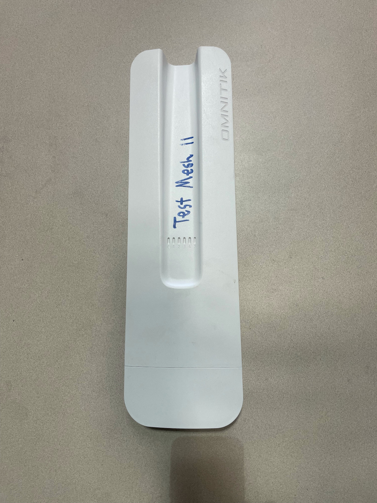
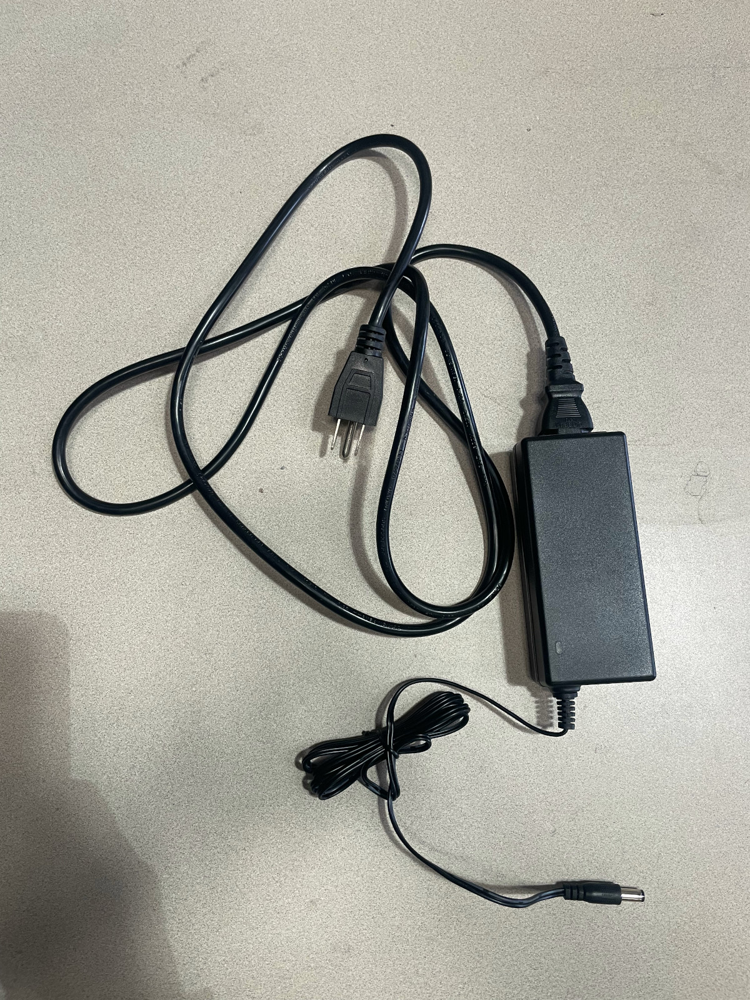
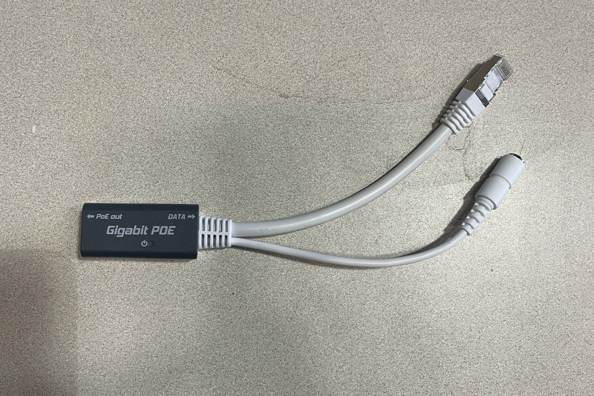

# Downgrading RouterOS 7 to RouterOS 6

!!! info "How can this documentation be improved?"

    - Better understand why we can't just install 6.49.19 directly, or how to make sure the wireless package is installed.
    - Add screenshots showing the configuration of the static IP address in versions of Windows commonly used by Tucson Mesh admin members
    - Add screenshots showing the Netinstall interface in versions of Windows commonly used by Tucson Mesh admin members

RouterOS is the operating system that runs on MicroTik devices such as the [OmniTIK](../../hardware/omnitik.md).

As of June 2026, we don't have a configuration for RouterOS 7, the latest version of the operating system that runs on MicroTik routers, that properly meshes over WDS. However, recent [OmniTIK](../../hardware/omnitik.md) devices come preinstalled with RouterOS 7. We need to downgrade it to a recenter version of RouterOS 6.

However, we have found that the typical firmware installation process doesn't work for downgrading. Instead, we have to use a method called [Netinstall](https://manual.mikrotik.com/docs/getting-started/netinstall) to downgrade the operating system.

This method can be used generally to install various versions of 

## Materials needed

- [OmniTIK](../../hardware/omnitik.md)

    

- Power Cord and AC Adapter

    

- POE Injector

    

- Indoor ethernet patch cable
- A computer running Windows or Linux
- Access to a power outlet
- Ethernet adapter. To use the netinstall process, we need to connect to the device via ethernet, not wireless.
- The netinstall program installed on your computer. It can be downloaded from the Mikrotik [downloads page](https://mikrotik.com/download/tools). See the Mikrotik [Netinstall documentation](https://manual.mikrotik.com/docs/getting-started/installation-and-upgrade/netinstall) for information on unpacking the release downloads.

!!! warning "Some USB ethernet adapters don't work"

    The netinstall documentation includes this warning: "Some computers (especially USB Ethernet adapters) may create extra link flaps, causing Netinstall to fail to detect a device in Etherboot mode. If this occurs, use a switch between your device and computer, or use a RouterOS-powered router in bridge mode."

## Before you start

Using the netinstall method of installing RouterOS involves configuring a static IP address for your computer and holding down the reset button of the device for specific amounts of time. It will make this process so much easier if you understand the entire process before you get started.

- Read the [Netinstall documentation](https://manual.mikrotik.com/docs/getting-started/installation-and-upgrade/netinstall)
- Read the [RouterBOOT documentation](https://manual.mikrotik.com/docs/getting-started/installation-and-upgrade/routerboot)

## Overview

These are the broad steps you'll be taking to install an appropriate version of RouterOS:

- Download the package file for an appropriate version of RouterOS
- Configure your network adapter to have a static IP
- Physically connect your computer to the router 
- Put the device in Etherboot mode
- Use the Netinstall program to install RouterOS

## Download the package file for an appropriate version of RouterOS

Go to the Mikrotik [downloads](https://mikrotik.com/download) page.

In the RouterOS section of the page, select `MIPSBE` for the `Architecture` and `6.49.18` for the `Version`.

!!! info "Why version 6.49.18?"

    As of June 2026, version 6.49.19 is the latest version of RouterOS 6. However, we've found that after installing it using netinstall, the wireless packages are not installed, which means the default management wireless network doesn't come up after the install.

This will download a file named `routeros-mipsbe-6.49.18.npk`.

## Configure your network adapter to have a static IP

If your computer does not have a built-in ethernet adapter, plug your USB ethernet adapter into a USB port on your computer.

Configure the network adapter so that it has an IP address of 192.168.88.2 and a subnet mask of 255.255.255.0.

### Linux

There are a variety of programs you can use to configure the network interfaces that depend on your Linux distribution and desktop environment. Some meshers use the `nmtui` command to open a text interface that allows step-by-step configuration.

The [Netinstall documentation](https://manual.mikrotik.com/docs/getting-started/installation-and-upgrade/netinstall) suggests these commands to configure the correct static IP on an ethernet interface. You will need to replace `<interface>` with the name of the interface you'll be using to connect your computer to the OmniTIK.

```
sudo ip addr add 192.168.88.2/24 dev <interface>
sudo ip link set <interface> up
```

You can use this command to see available network interfaces on your computer:

```
ip link show
```

### Windows

See the [Netinstall documentation](https://manual.mikrotik.com/docs/getting-started/installation-and-upgrade/netinstall) for instructions and screenshots for configuring network interfaces in Windows.

## Connect AC adapter, ethernet cables

- Plug in the AC adapter to a power outlet or strip. 
- Connect the AC adapter to the POE injector.
- Plug the ethernet cable into the POE out port of the injector.
- Plug the data end of the POE injector into the computer's ethernet adapter.

Don't plug the other end of the ethernet cable into the OmniTIK yet. You'll do that in the next step.

## (Windows) start Netinstall

See the [Netinstall documentation](https://manual.mikrotik.com/docs/getting-started/installation-and-upgrade/netinstall) for instructions and screenshots for starting the Netinstall application.

## Put the OmniTIK into Etherboot mode 

- Plug the free end of the ethernet cable into port 1 of the OmniTIK.
- Immediately hold down the reset button.
- Keep holding the button down for about 15 seconds. Look for this sequence of LED flashes on the left-most LED.
  - After 5 seconds, the LED starts flasshing.
  - After 10 seconds, the LED turns solid.
  - After 15 seconds, the LED turns off.

## Install the RouterOS package with Netinstall

### Windows

See the [Netinstall documentation](https://manual.mikrotik.com/docs/getting-started/installation-and-upgrade/netinstall) for instructions and screenshots for installing the RouterOS package with  Netinstall.

### Linux

Run this command:

```
sudo ./netinstall-cli -r -a 192.168.88.3 routeros-mipsbe-6.49.18.npk
```

In the above command, you might have to change `./netinstall-cli` to the path where you installed the program and `routeros-mipsbe-6.49.18.npk` to the path where you downloaded the package.

You should see output similar to this:

```
Will apply default config
Waiting for Link-UP on eth0
Using client IP 192.168.88.3
Waiting for RouterBOARD...
Received a BOOTP request from 01:23:45:67:89:AA (arm64)
Assigned 192.168.88.3 to 01:23:45:67:89:AA
blksize 1452
Booting device 01:23:45:67:89:AA into setup mode
Formatting device 01:23:45:67:89:AA
Sending packages to device 01:23:45:67:89:AA
Packages sent to device 01:23:45:67:89:AA
Rebooting device 01:23:45:67:89:AA
Successfully finished installing device 01:23:45:67:89:AA
```

The interface `eth0` may differ depending on your device and the MAC addresses will also differ.

## Finish up

The router should reboot and you should see the management WiFi network appear. Disconnect the ethernet cable from your computer's ethernet adapter. You can now upgrade to the latest version of RouterOS 6 through WinBox or the web interface, as well as install a configuration file. See [MikroTik OmniTIK 5 PoE ac Router Configuration Guide](omnitik.md) for detailed instructions. 

