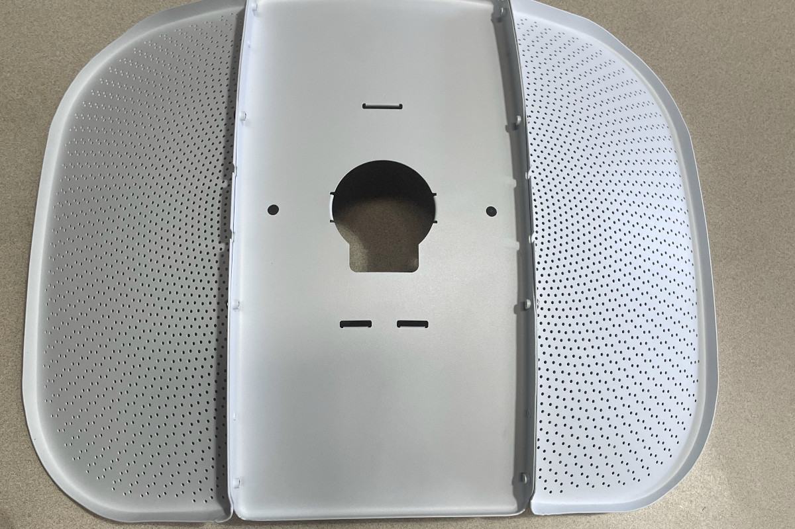
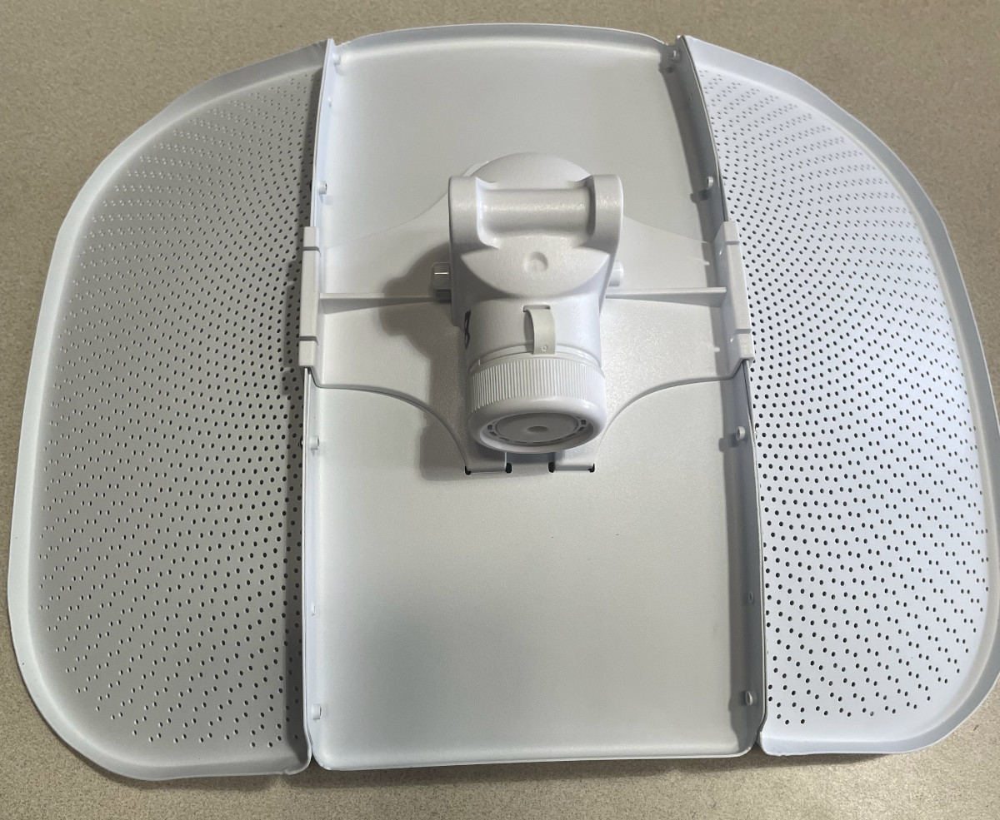
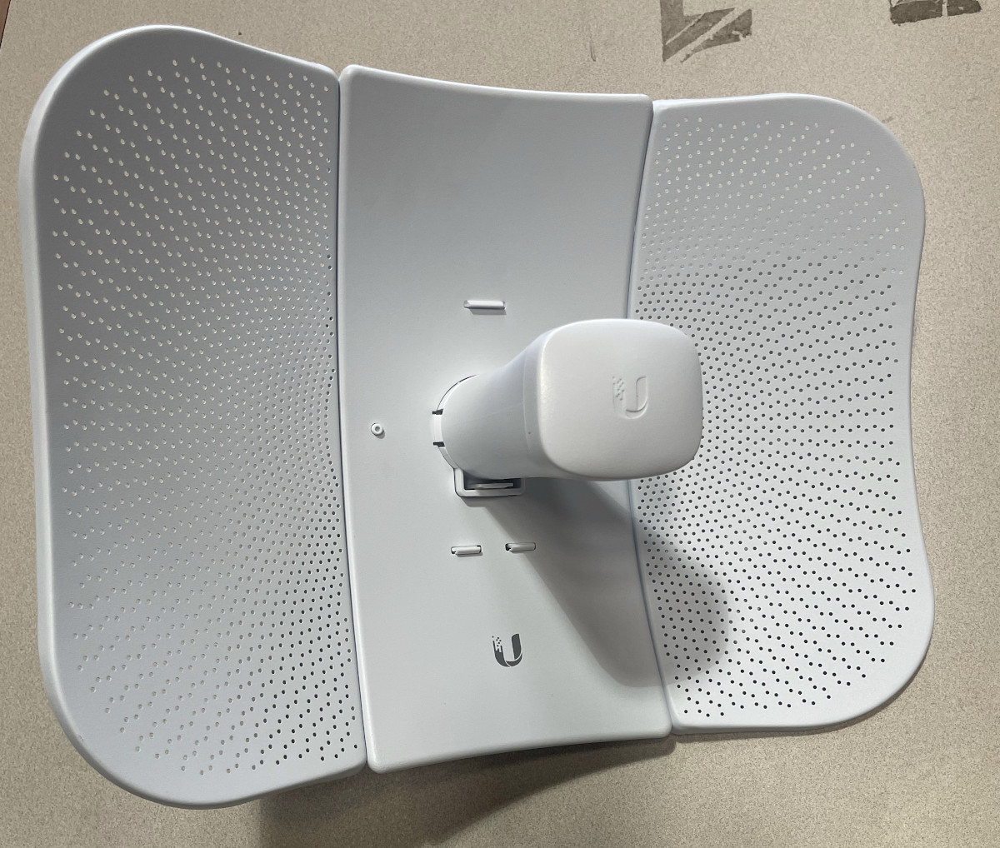
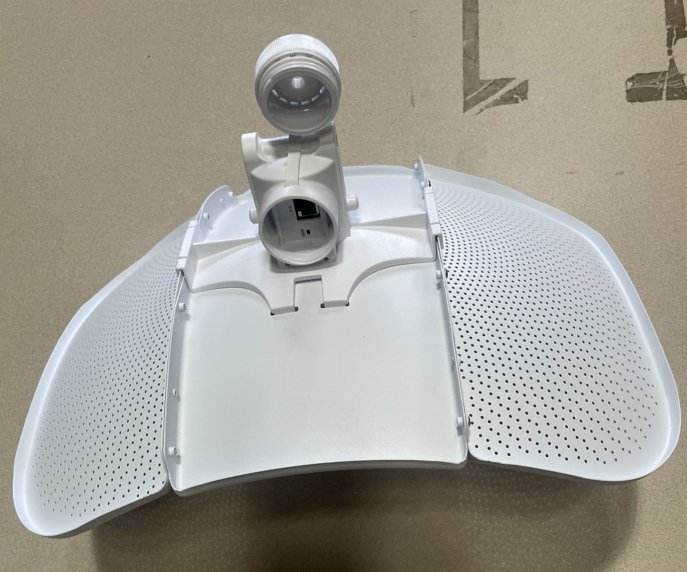
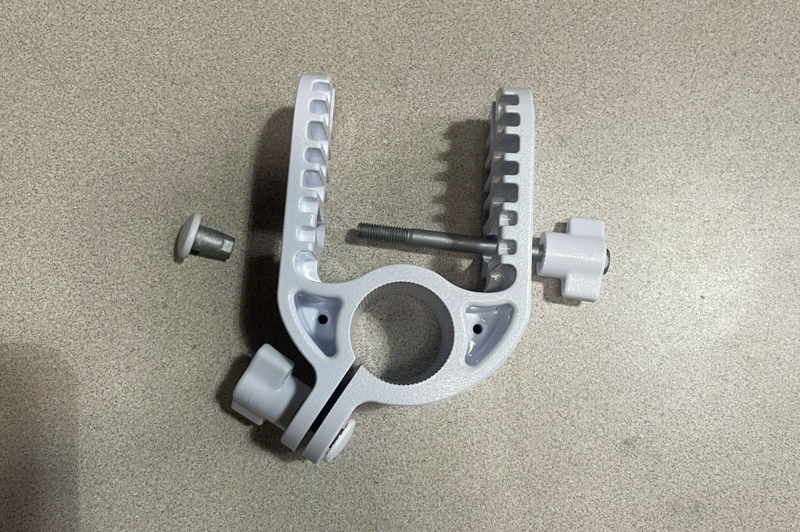
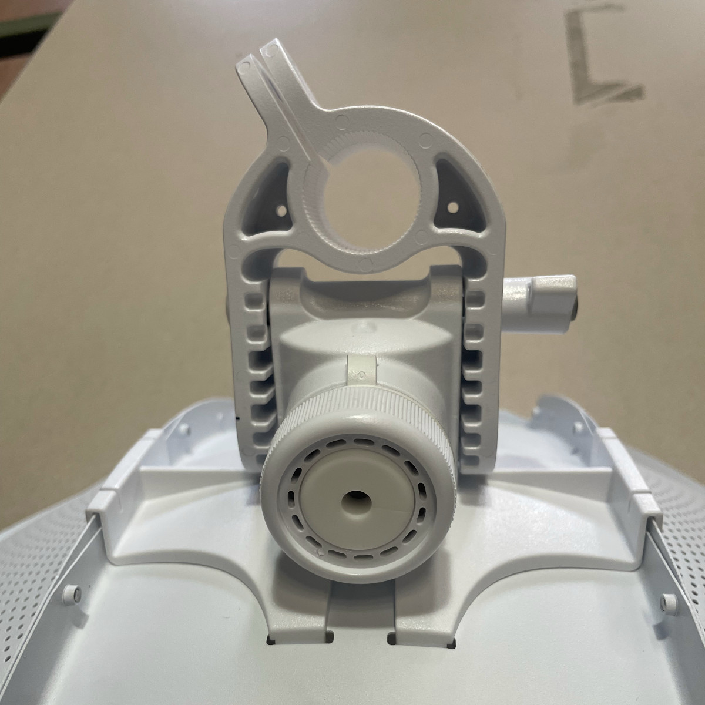
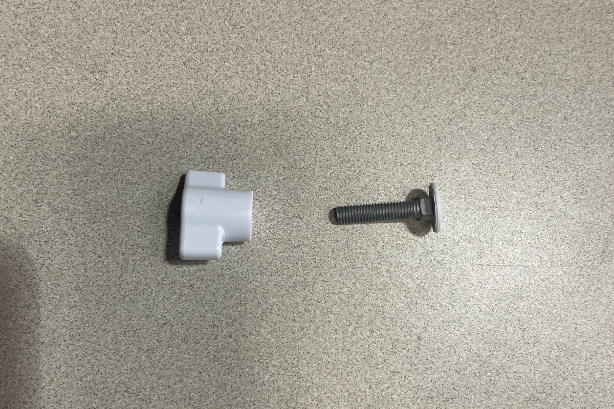
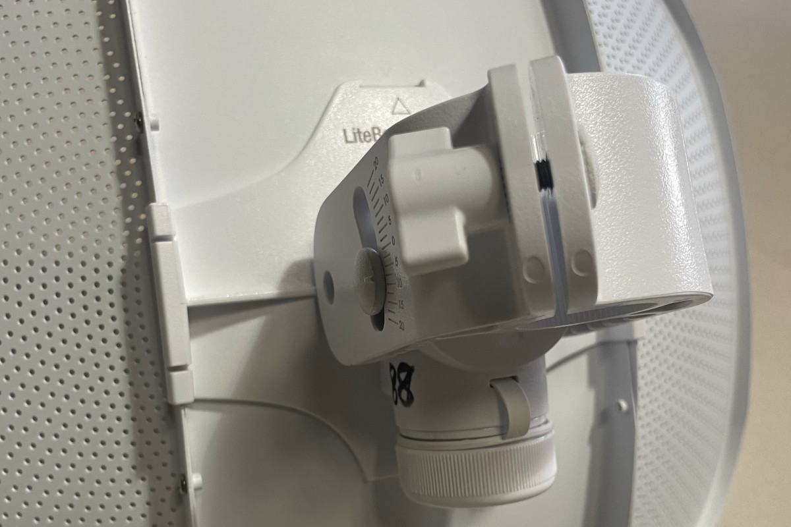
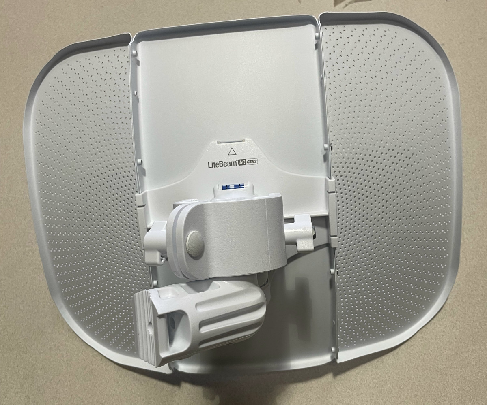
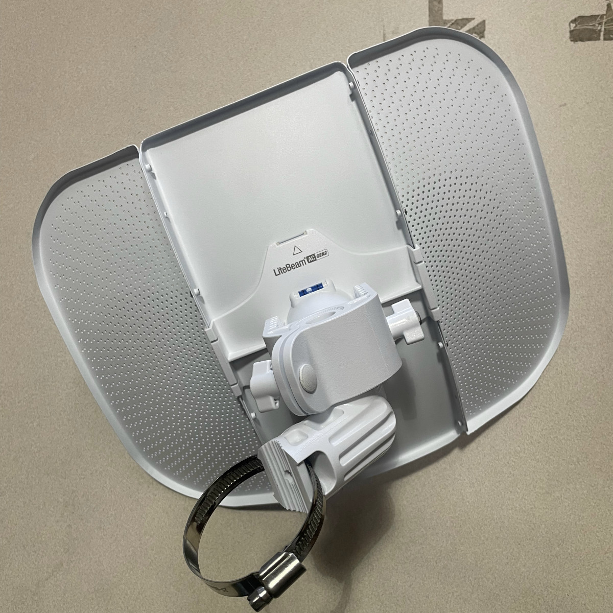

# Ubiquiti LightBeam AC Gen 2 Router Configuration Guide

This is a guide for configuring the [Ubiquiti LightBeam AC Gen 2](../../hardware/litebeam.md), the device that connects a user's node to the [supernode](../../networking/supernodes/index.md).

## Materials needed 

- LiteBeam device  
    - Dish
    - Antenna feed
    - Feed receiver 
    - Elevation mount
    - Screws and wingnuts  
    - Azimith mount
- Hose clamp  
- Power cable  
- POE Injector  
- Network Number (NN). Check the “Installed” column on the [Install Trello](https://trello.com/b/q0fcwjCM/mesh-installs) list and use the next number in line.  
- The default administrator username and password for LiteBeam devices. This is in the password manager as `Ubiquiti LiteAP/LBE admin`.

## Overview 

To configure the LBE, you will need to take a number of steps. The broad goals of these steps are to:

- assemble the device
- update the firmware (the operating system)  
- load in a Tucson Mesh configuration

Our configuration is based off of NYC Mesh's, who has a [handy-dandy guide](https://wiki.nycmesh.net/books/3-hardware-firmware/page/ubiquiti-litebeam-ac-lbe-5ac-gen2) for configuring routers that mostly works for Tucson Mesh with a few small adjustments. 

## Assemble the device 

First you will need to assemble the device. This takes about 5 minutes and requires only a small phillips head screwdriver.

1. Slot together the center and two side *reflector panels* to form a dish. Use a small screwdriver to lock these 3 pieces together.

    

2. Place the *feed receiver* into the back of the dish. It snaps into place into one tab at the top, two at the bottom and a pair of holes on both of the side wings.

    

3. Snap the *antenna feed* into the *feed receiver*. The tab and the ethernet port should be facing down (i.e toward the "U" logo).

    

    

4. Find the correct hardware for the *elevation mount*, which is the piece that allows for adjusting vertical alignment: long bolt, small white nub, and hand tightening wingnut.

    

5. Snap the *elevation mount* onto the *feed receiver*. Make sure the degree markings are right side up. Slot the long bolt with the wingnut through the *elevation mount* and *feed receiver*  and into the shorter bolt.

    

6. Find the correct hardware for the clamp that wraps the *elevation mount* around the *azimuth mount*, allowing horizontal alignment: a short bolt and wingnut.

    

7. Insert the hardware into opposite ends of the *elevation mount* clamp and tighten lightly.

    

8. Insert the *azimuth mount* into the clamp on the *elevation mount*.

    

9. Attach a *hose clamp* through the *azimuth mount.*

    

## Download firmware 

Start off by downloading the firmware that you need. You can find the 8.7.1 version of the firmware [here](https://dl.ui.com/firmwares/XC-fw/v8.7.1/WA.v8.7.1.42832.200623.1641.bin). You may not need to use this file if the firmware on the device is already up to date. We'll check this later.

## Generate a new configuration 

1. Navigate to the [configuration generator](https://tucsonmesh.github.io/tucsonmesh-configgen) in your browser.   
2. Select the latest version for the `Version` select input.  
3. Select the appropriate device (`Litebeam5AC`) for the `Device` select input.  
4. Choose `lbe-new-8_7_1.cfg.tmpl` for the `Template` select input.  
5. Enter the Network Number (NN) you selected at the beginning of this configuration based on Tucson Mesh’s install Trello board.
6. Click the `Download config` button.

## Power on the device 

1. Plug the power cable into the PoE injector and plug the other end into an outlet.  
2. Plug an ethernet cable into the port on the PoE injector labeled POE.   
3. Unscrew the cover that looks like the lid of a Nalgene bottle and plug the other end of the ethernet cable into the port on the LiteBeam. 

## Connect to the management WiFi network 

1. Once the device powers up, a blue light will appear on the router and it will enable a management network whose SSID looks something like `LBE-5AC-Gen2`. Connect to this network.

## Browse to the management web interface 

1. Once connected to the wireless network, navigate to https://192.168.172.1 in your browser if your device does not automatically redirect you.
1. You may be met with a warning due to a self-signed security certificate. Bypass this warning. This will bring you to the LiteBeam's management interface.  

## Update the firmware if needed 

1. Click on the `System` menu item (a gear icon) in the left-hand sidebar.  
2. Look at the item labeled `Firmware Version`. The value will be something like `WA.V8.7.11`. If the value begins with `WA.V8.7.`, for example `WA.V8.7.11` then you don't need to update the firmware and you can skip to the next step.  
3. Click the `Upload` link next to the `Upload Firmware` label and in the file selection dialog select the firmware file you downloaded earlier. It will end in `.bin`.  
4. You will see a modal labeled `Uploading` with a progress bar.  
5. When the firmware has completed uploading, the progress modal will close and a new one will open in the upper-right-hand corner of the screen. It will be labeled `Firmware Update`. Click the `Update` button.  
6. A new modal will open showing the status. It will first show `Initializing Firmware Update` and then `Upgrading`.  
7. You may get temporarily disconnected from the management wireless network. If you get disconnected, reconnect to the management network and reload the web management interface in your browser.  
8. The `Firmware Version` should now reflect the version of the firmware you downloaded.

## Upload the configuration file 

1. In this interface you will go through a “Please Set Up Your Device” prompt, where you will select `United States` under `Country` and `English` under `Language`.   
2. Check the Terms of Use checkbox and click `Upload Backup Configuration`. Choose the .cfg file you downloaded from the configuration generator.
4. You will see a prompt on the top-right corner of the screen saying Configuration backup file uploaded. Click `Apply` and wait a minute for the page to reload. Sometimes you will have to refresh the page to get back into the interface.  
5. The configuration you uploaded will change the username and password to access the management web interface. To log back in, use the credentials you gathered before the install. These are the credentials labeled `Ubiquiti LiteAP/LBE admin` in the password manager.

## Pair with the supernode 

1. Check the street address of the node where the LiteBeam will live relative to the supernode. This will give you a sense of which network (which corresponds to one of the sector antennas) will give you the best signal.  
2. To pair with the supernode, go to `Settings` \> `Wireless` and click the SSID `SELECT…` button. This will do a scan.
3. Click the button next to the best AirMax AC signal. This should be the same SSID you identified based on looking at the map. (-80 is bad, \-50 is good, \-62 is typical)
4. Click `SELECT` and then `SAVE CHANGES` (twice if necessary)

