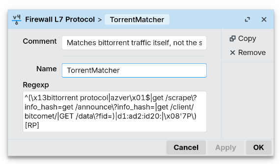

# MikroTik OmniTIK 5 PoE ac Router Torrent Blocking Guide

This is a guide for how you can attempt to block plaintext BitTorrent traffic on your Mikrotik router (such as the OmniTIK 5 PoE). It's following the methodology from [this post](https://forum.mikrotik.com/t/block-torrent-downloads/153252/5) on the Mikrotik forums.

## Adding an L7 Protocol Matcher

On Mikrotik devices, you can use [Layer7 Protocol Matchers](https://help.mikrotik.com/docs/spaces/ROS/pages/130220161/Layer7) to annotate unencrypted traffic that matches user-defined patterns going through the router. These patterns are built as [regular expressions](https://simple.wikipedia.org/wiki/Regular_expression) that tell the computer what sorts of basic text patterns to look for. If we can give it a regular expression that tells it how to recognize BitTorrent traffic, it can mark it as such and we can add a firewall rule that blocks it.

To try to detect unencrypted BitTorrent traffic, we will use the Layer7 expression that this post suggests:

```
^(\x13bittorrent protocol|azver\x01$|get /scrape\?info_hash=get /announce\?info_hash=|get /client/bitcomet/|GET /data\?fid=)|d1:ad2:id20:|\x08'7P\)[RP]
```

Let's not worry about trying to figure out how it works. Let's just assume it does. We'll log into our RouterOS interface in [Winbox](https://mikrotik.com/download/winbox). Navigate to `IP -> Firewall`. In the window that pops up, choose the `Layer7 Protocols` tab. Make a `new` Layer7 protocol and fill out the Rexexp field:



Name it something easy, like `TorrentMatcher`. We'll need this name in the next step.

## Adding Firewall Rules

There are two things we need to do next:

1. Add a firewall rule that causes the router to look for and mark traffic streams that match the Layer7 regexp
2. Add two firewall rules that block this traffic, one for TCP traffic and one for UDP traffic.

Rather than show screenshots of each tab in the new firewall rule creator, let's use the RouterOS terminal to configure things more easily. In Winbox, click `New Terminal` on the left pane. In the window that pops up, we'll copy and paste these three commands, all slightly tuned for Tucson Mesh:

First, add the firewall rule that marks traffic matching this L7 protocol to a dynamic address list. Note that the `layer7-protocol=TorrentMatcher` piece must give the name you set for the L7 protocol in the previous step.

```
/ip firewall filter add chain=forward action=add-src-to-address-list layer7-protocol=TorrentMatcher src-address-list=meshaddr address-list=Torrent-Conns address-list-timeout=2m comment="Add this source address to the list of \"torrent addresses\" so that we can filter them"
```

This rule adds traffic that matches that protocol to the `Torrent-Conns` address list and gives it a two minute timeout. Next, we'll add the two firewall rules that block this specific traffic.

```
/ip firewall filter add chain=forward action=drop protocol=tcp src-address-list=Torrent-Conns dst-port=!0-1024,8291,5900,5800,3389,14147,5222 comment="Filter particular TCP ports for connections that look to be torrenting"
/ip firewall filter add chain=forward action=drop protocol=udp src-address-list=Torrent-Conns dst-port=!0-1024,8291,5900,5800,3389,14147,5222,59905 comment="Filter particular UDP ports for connections that look to be torrenting"
```

And that's it. You can go look at the rules visually back in `IP -> Firewall -> Filter Rules` and enable/disable them in the future or otherwise make edits if they seem to be causing issues.