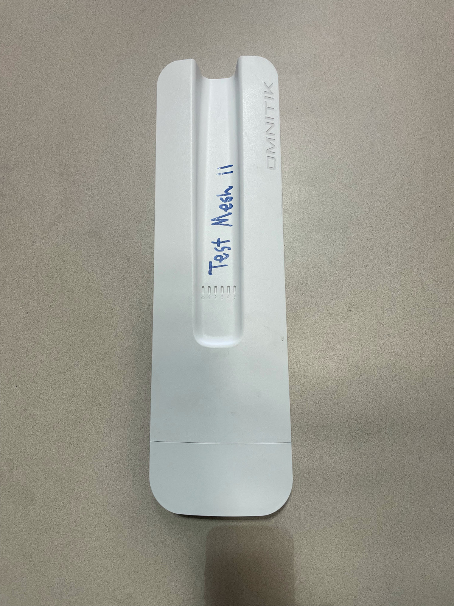
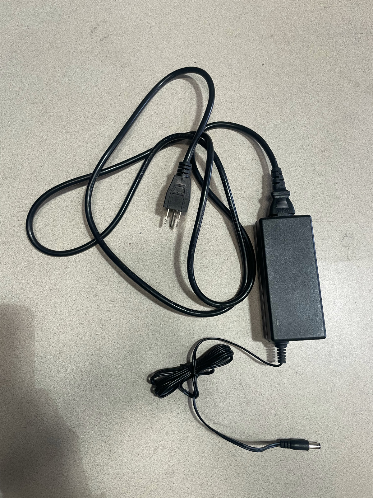
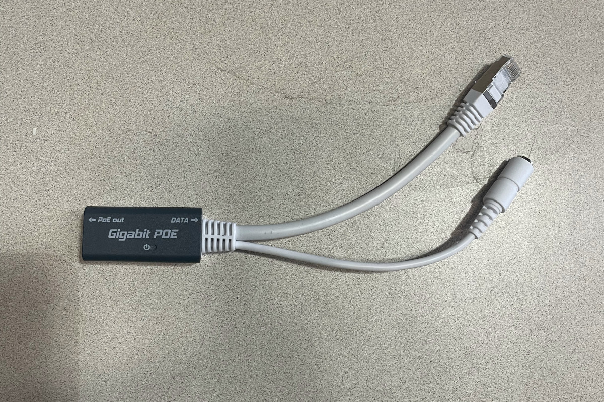

# MikroTik OmniTIK 5 PoE ac Router Configuration Guide

!!! info "How can this documentation be improved?"

    - Explain how to connect to the device with an ethernet cable if the automatic management wifi network disappears.
    - Update "gut checks" to be more explicit.

This is a guide for configuring the [MikroTik OmniTIK 5 PoE ac](../../hardware/omnitik.md).

## Materials needed

- OmniTIK ([OmniTIK series \- User manuals \- MikroTik Documentation](https://help.mikrotik.com/docs/spaces/UM/pages/14221325/OmniTIK+series))

    

- Power Cord and AC Adapter

    

- POE Injector

    

- Indoor ethernet patch cable
- Computer that can WinBox or an SCP client
- Network number. Check the mesh installs Trello board to see what the next unused network number would be.
- Access to a power outlet
- The password to connect to the node's wireless network (i.e. the one that will be named `tucsonmesh-NN-omni` where `NN` is replaced with the network number). This is labeled `tucsonmesh-*-omni WiFi Password / PSK` in the password manager.
- The username and password for the device's web management interface. This is labeled `Omnitik & SXT - admin` in the password manager.

## Download software for uploading files to the router

You will need software that can talk to the router and upload the firmware and config file from your computer to the router.

### For Windows

Download one of these applications.

* [WinBox](https://mikrotik.com/download): A desktop application for managing MikroTik routers.
* [PuTTY](https://www.chiark.greenend.org.uk/~sgtatham/putty/): A program for connecting computers using a secure protocol. It can also upload and download files using that protocol.
  * You must download pscp.exe from PuTTY (64-bit or 32-bit) to the folder that where you will be downloading the router config files. (For example, the `Downloads` folder).

### For Mac

* [WinBox](https://mikrotik.com/download): A desktop application for managing MikroTik routers. The 4.0beta version supports macOS.
* macOS should come with a command-line SCP client already installed.

### Linux

* Most Linux distributions come with a command-line SCP client already installed.
- [WinBox](https://mikrotik.com/download): The 4.0beta version supports Linux.

## Overview

1. **Download correct firmware**
2. **Generate and download config file**

*Configuring an Omni is very similar to configuring LiteBeams. You will need to first update the firmware, and then upload a TucsonMesh version of the configuration. In a given install, the Omni will have the same network number as the LBE.*

## Power on the Omni

1. Take the OmniTik device out of the box.
2. Connect the power chord to the AC adapter and plug the power chord into an outlet.
3. Plug the skinny plug on the other end of the AC adapter into the POE injector.
4. Plug the one end of the patch cable into the POE injector and the other end into the POE port on the Omni. On recent versions, this port is labeled "PoE in".

## Download the correct firmware

1. Start by [downloading](https://mikrotik.com/download) the latest Long-Term v6 version of the firmware for the MIPSBE architecture. As of April 2025, this is version ([6.49.18](https://download.mikrotik.com/routeros/6.49.18/routeros-mipsbe-6.49.18.npk)).
2. This will download a .npk file named something like `routeros-mipsbe-6.49.18.npk`.

## Generate and download a configuration file

1. Navigate to the [TucsonMesh configuration generator](https://tucsonmesh.github.io/tucsonmesh-configgen/) in your browser.
2. Make sure that the `Device` drop down is set to `Omnitik5AC`.
3. Enter the `Network Number` for the install.
4. Click `Download Config`. This will download a .rsc file called something like `omni-poe-ether5.rsc`.

## Connect to the OmniTIK's wireless network

!!! warning "Be ready to be disconnected"

    Connecting to the Omnitik's network will disconnect you from the internet, so make sure you have **WinBox** or an **SCP client**, **firmware** and the **router configuration** file downloaded before proceeding.

1. Next, plug in your Omnitik and give it about a minute to boot up.
2. Connect to the wireless network that it generates automatically. This network will look something like `Mikrotik-F32xxxx`.

## Upload firmware

### Using the MikroTik web interface

1. Open the MikroTik graphical user interface (GUI)  in your browser by pasting `192.168.88.1` into the location bar.
2. If prompted to log in, log in using the default username, `admin`. There is no password. If it prompts you to change the password, click “Cancel” to proceed.
3. Click “Webfig” in the top right corner.
4. Click “Files” in the left side menu.
5. Click “Choose File” or "Browse” at the top.
6. Navigate to where you saved the firmware, select the file and click “Open”. You will see the file appear in the interface.
7. Wait for the firmware to fully upload (you will see the upload progress in the bottom left corner).
8. This firmware will automatically be installed when you reboot with the new configuration (see next section).

### Using WinBox

1. Open WinBox. Make sure `Neighbors` is selected in the `Select from` dropdown. Double-click on the MAC Address of the OmniTIK which will appear as a Neighbor with an IP address of `192.168.88.1`.
2. Make sure `admin` is entered in the `Login` field and then click `Connect`. You are now looking at the router’s Graphical User Interface (GUI). It has menus, buttons and inputs that control the router’s settings.
3. Upload the firmware you downloaded into the Omni. Click on the `Files` item in the left-hand menu and drag the .npk file from your computer into the right-hand pane.
4. Click on `System` in the left-hand-side menu and then click `Reboot`. Click `OK` in the confirmation dialog.
5. WinBox will show a message that you have been disconnected from the device while it reboots. The LEDs on the front of the device should flash and you should hear a beep telling you that the device has rebooted.
6. Reconnect to the management wireless network.
7. Log into the device in WinBox. If you've left WinBox open, you may be able to just click a button to reconnect.
8. Confirm in the `Files` window that the .npk file you uploaded is no longer there. This means the update has been installed.

## Upload configuration file

### Using an SCP client

#### Mac or Linux

1. Open a terminal program on your computer (on a Mac the app is literally called [Terminal](https://support.apple.com/guide/terminal/welcome/mac))
2. Change directory to the folder where you’ve saved the config using the `cd` command. For example, if you download the configuration file to the default download location on a Mac, the `Downloads` folder in a user's home directory, you would type `cd ~/Downloads` and then type the `return` key to change to the correct folder.
3. Copy the router configuration file from your computer to the router with the following command: `scp -o StrictHostKeyChecking=no omni-poe-ether5.rsc admin@192.168.88.1:flash/`

#### Windows, using PuTTY

1. If you are using a Windows operating system, open the `Command Prompt` on your computer.
   1. Select the `Start` menu (the Windows icon) on the taskbar, or press the Windows key on your keyboard.
   2. Type `cmd` in the search input.
   3. Select `Command Prompt` from the search results.
2. In the command prompt window, navigate to the folder where you’ve saved the config using the `cd` command. For example, if you saved the configuration file in the default location, the `Downloads` folder in your home directory, you would type  `cd Downloads` and press the return key to change the directory.
   1. If you entered this command correctly, you won't see any message, you'll just get a new prompt below the one where you typed the `cd` command.
   2. You can learn more about using the `cd` command in [this article](https://www.lifewire.com/change-directories-in-command-prompt-5185508).
3. Paste this command into Command Prompt, replacing the highlighted portion with the configuration file you just downloaded:
   `pscp -scp omni-poe-ether5.rsc admin@192.168.88.1:flash/`

#### Using WinBox

1. Open the `Files` window again and drag and drop the config file (the one that ends in `.rsc`) from your computer into the `Files` window.

## Reboot the device with the new configuration

### Using the administrative web interface

1. Reopen the MikroTik GUI in your web browser and navigate back to `Files` as described in section 3 above. You should see the config file you just uploaded.
2. Click `System` in the left side menu.
3. Click `Reset Configuration` in the left side menu dropdown.
4. Select `No Default Configuration`
5. Run After Reset: `flash/omni-poe-ether5.rsc` (click the popup on the right to select this).
6. Click `Reset Configuration`,
7. The Omnitik will now reboot (and install new firmware if you uploaded it). If it plays some beeps, ending with an 8-bit version of [Zombie Nation’s KernKraft 400](https://youtu.be/gbcG2TI4GBk?t=116) 🤘🤘🤘. If you hear this, the configuration was a success.

### Using WinBox

1. Open the Terminal in WinBox and type `import flash/omni-poe-ether5.rsc`. Replace `flash/omni-poe-ether5.rsc` with the name of the file you just uploaded if it is different.
2. Press the `enter` or return key on your computer and the Omni should load up the config.
3. The Omni will beep and you will be disconnected from the device in WinBox as well as the management wireless network.

## Set the administrative password

1. Connect to the new WiFi network created for the Omni router. The name of this network will be `tucsonmesh-NN-omni` where `NN` is replaced by the network number for this node, for example, `tucsonmesh-79-omni`.
2. Log in to the OmniTIK on your browser. The OmniTIK IP address has changed to a **10.69.x.x address.** This is generated from the network number, e.g. for network number 79 the IP address will be `10.69.0.79`, and you'll type `http://10.69.0.79` in your browser's location bar to access the administration interface.
3. Upon connecting, you may be prompted to enter a new password. Leave the `Old Password` field blank and enter the standard Tucson Mesh OmniTik password (iykyk) in the `New Password` and `Confirm Password` fields. 
4. If you are not prompted automatically to enter a new password, click `WebFig` in the upper-right-hand corner menu. Then click `System` in the left side menu, and then click `Password` in the sub-menu.
5. Leave the `Old Password` field blank and enter the standard Tucson Mesh OmniTik password (iykyk) in the `New Password` and `Confirm Password` fields.
6. Click the `Password` button. 

## Verify the configuration

After resetting, check the OmniTik to make sure that the router was reconfigured using the file you uploaded.

You can do a few “gut checks” like seeing that the WPS password is correctly set or checking to see that ethernet port 5 has POE activated (this is the port that will power the LBE).

## Label and store the Omni

Write the network number on the Omni box and the Omni router itself and put it away for your install\!

