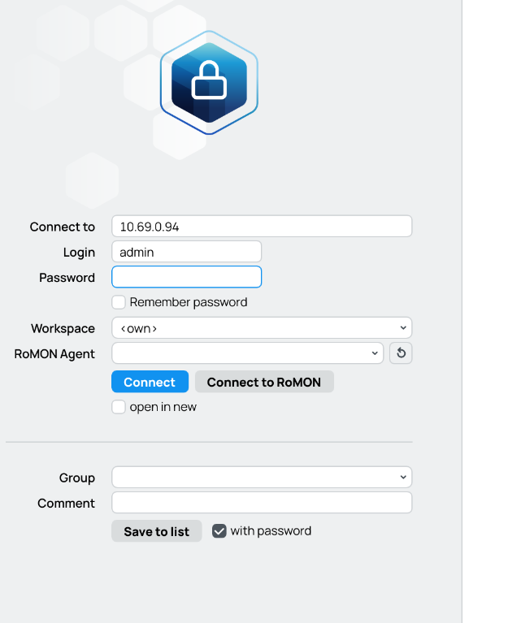
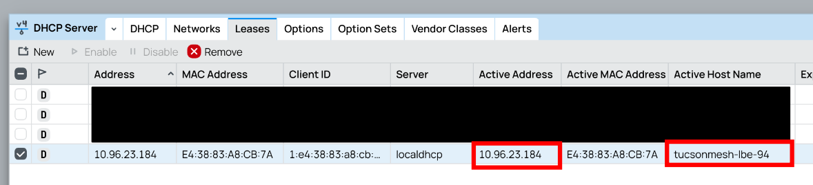
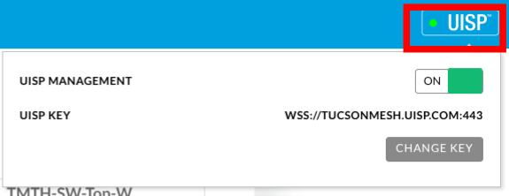
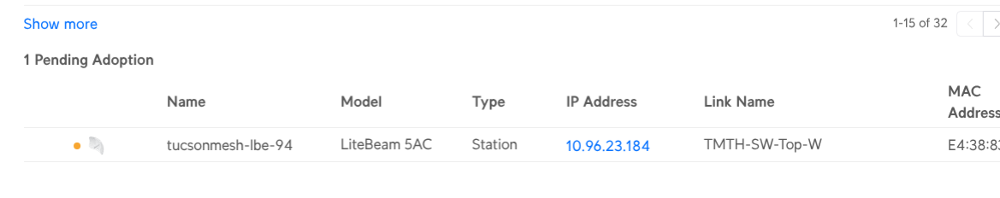
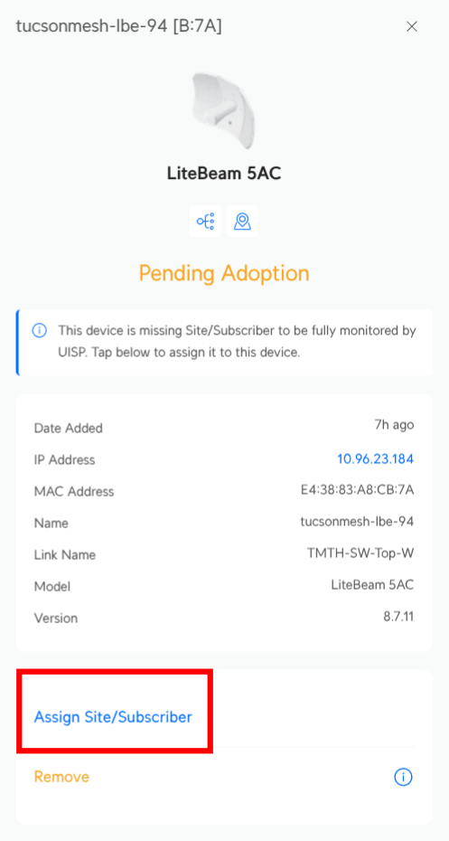
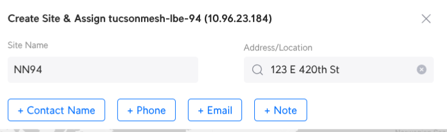

# Ubiquiti LiteBeam 5AC - Pairing with UISP

This is a guide for pairing the [Ubiquiti LiteBeam 5AC](../../hardware/litebeam.md) with Tucson Mesh's UISP instance.

## Finding Your LiteBeam

In this portion of the guide, we are walking through how you would find and connect to a LiteBeam remotely, assuming that you have a working OmniTik 5AC & LiteBeam setup. If you already have a way of accessing your LiteBeam's management interface (because you're physically nearby and can reboot it to spin up the management WiFi network or similar), skip down to [the next section](#pairing-the-litebeam-with-uisp)

To get started we first need to find the IP address of the LiteBeam on the mesh. Only Omnitiks have statically allocated IPs (based on their node number/NN), so our first goal is to identify what IP has been assigned to this Litebeam by [DHCP](https://simple.wikipedia.org/wiki/Dynamic_Host_Configuration_Protocol).

First, let's open Winbox and connect to your Omnitik device.

Once logged in using the credentials stored in the Tucson Mesh Bitwarden, navigate to IP -> DHCP Server.

Then, head to the Leases tab and look for the device with an `Active Host Name` of `tucsonmesh-lbe-<NN>`. Then, to the left of that, you should find the actively assigned IP address.

With that, we can move on to pairing the LiteBeam with UISP.

## Pairing the LiteBeam with UISP

Using your web browser, navigate to the IP address of your LiteBeam. You will likely get a warning about the LiteBeam's self-signed TLS certificate. Just tell your browser to continue. You'll find yourself at the login page.

Once you are logged in, you should notice a button that says `UISP` in the top right corner, and it likely has a flashing amber light next to it. If the light next to the icon is green, your LiteBeam is already paired with UISP. You may want to go check there and see if you can find it.

Click this button, and a small menu will drop down. Select `Change Key`.

In the text window that opens, fill in the `UISP Device Adoption Key` from Bitwarden. After clicking OK, the UISP icon should change to showing a green circle after a few moments.

If the light never turns green, make sure your LiteBeam can reach the internet. If it can't reach the internet, then it can't reach UISP either. After this, we need to login to UISP and adopt the new device.

Navigate to [https://tucsonmesh.uisp.com](https://tucsonmesh.uisp.com) and log in with your credentials. On the devices page, typically at the very bottom, there should be a list of devices that are "pending adoption". In this case, we only have one:

Select your pending LBE and choose `Assign Site/Subscriber`.

We tend to assign devices as `Sites` as we don't use any of the "customer management"-oriented pieces of UISP. So, say you're creating a new Site and fill out the relevant information.

After confirming the new site information, the new LBE should shortly then move from Pending Devices to the broader list. You did it!