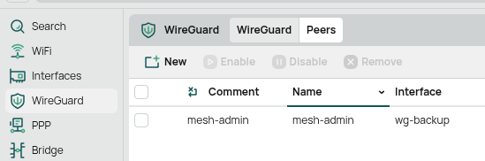
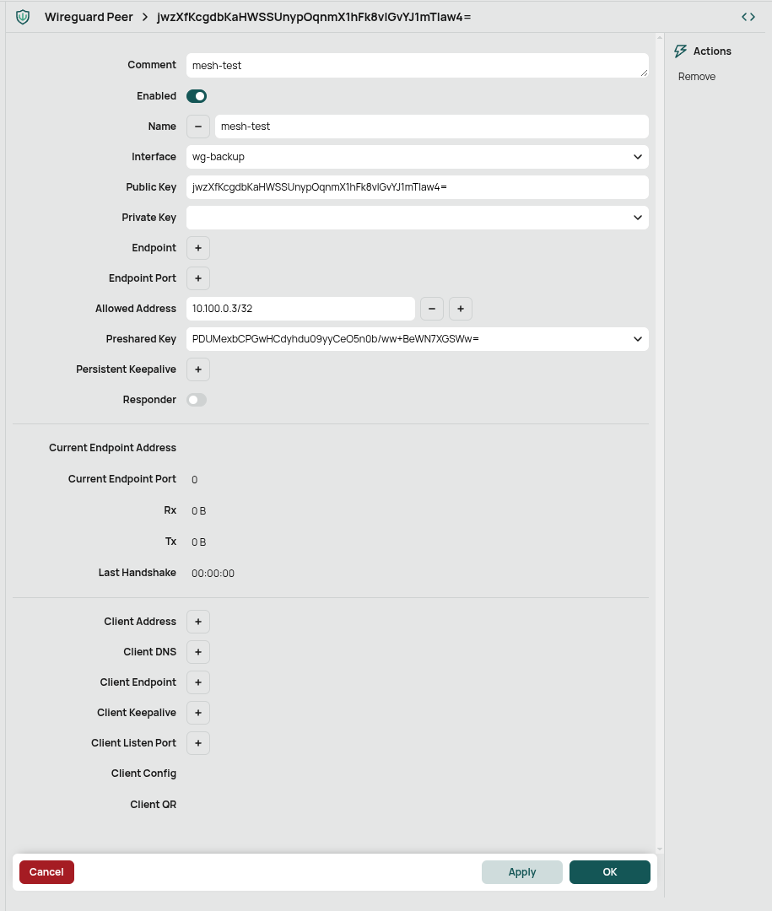
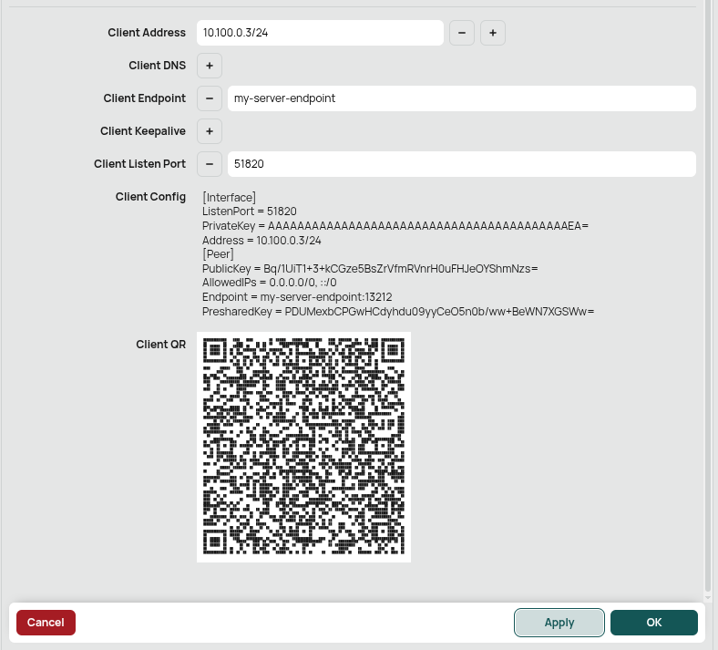

# Adding Wireguard Users to a RouterOS v7 Wireguard Server

[Wireguard](https://www.wireguard.com/) is a modern VPN tunnel with an emphasis on simplicity, security, and speed.
Some infrastructure in the mesh, like the [MikroTik CCR2004-16G-2S+](https://mikrotik.com/product/ccr2004_16g_2splus) in the [Tucson House Supernode](../../networking/supernodes/tucson-house.md), provides a Wireguard tunnel to help the mesh admin crew access and debug equipment from afar.
For MikroTik equipment, this functionality is only available on devices that are running [RouterOS v7](https://help.mikrotik.com/docs/spaces/ROS/pages/115736772/Upgrading+to+v7).
In this guide, we'll go through the steps that are needed to add another client to this server, assuming you already have some level of existing access.

## Requirements

- Access to a linux terminal of some kind
  - Windows: install the [Windows Subsystem for Linux](https://learn.microsoft.com/en-us/windows/wsl/install) and perform these tasks from a virtualized Ubuntu environment.
- On your linux environment: install either the `wireguard` or `wireguard-tools` package, with the specific package chosen from [here](https://www.wireguard.com/install/)
  - If you're on Ubuntu, you'll want `wireguard`
  - If you're on Fedora, you'll want `wireguard-tools`

Once you have the right software installed, the `wg` command will be available in your terminal similar to the following:

```bash
admin@mesh-box:~$ wg --help
Usage: wg <cmd> [<args>]

Available subcommands:
  show: Shows the current configuration and device information
  showconf: Shows the current configuration of a given WireGuard interface, for use with 'setconf'
  set: Change the current configuration, add peers, remove peers, or change peers
  setconf: Applies a configuration file to a WireGuard interface
  addconf: Appends a configuration file to a WireGuard interface
  syncconf: Synchronizes a configuration file to a WireGuard interface
  genkey: Generates a new private key and writes it to stdout
  genpsk: Generates a new preshared key and writes it to stdout
  pubkey: Reads a private key from stdin and writes a public key to stdout
You may pass `--help' to any of these subcommands to view usage.
```

## Key Generation

Wireguard tunnels are based on [public key cryptography](https://en.wikipedia.org/wiki/Public-key_cryptography).
Creating a new client configuration file involves generating a new private key, public key, and, because we like to keep things a bit extra 💅, a preshared key.
This sequence of steps will look like the following:

!!! warning "In practice, **Never** use a private key that is exposed in documentation like this. Ideally, never expose your private key at all. It's called _private_ for a reason."

```bash
# 1. Ensure your umask is set to something secure.
# This helps ensure that the file we create here is not readable by any user on your machine
admin@mesh-box:~$ umask 077

# 2. Generate your private key
admin@mesh-box:~$ wg genkey > my-wireguard-key
# This value is private, keep it well-protected!
admin@mesh-box:~$ cat my-wireguard-key
sGg9iLeI2hKbOER69FkhBuE2vA76CaEPsIPrJH7nGGI=

# 3. Compute the corresponding public key and save it to a file
admin@mesh-box:~$ wg pubkey < my-wireguard-key > my-wireguard-key.pub
admin@mesh-box:~$ cat my-wireguard-key.pub
jwzXfKcgdbKaHWSSUnypOqnmX1hFk8vIGvYJ1mTIaw4=

# 4. Generate a new preshared key that we will use to enhance the security of our connection
admin@mesh-box:~$ wg genpsk > my-wireguard-psk
admin@mesh-box:~$ cat my-wireguard-psk
PDUMexbCPGwHCdyhdu09yyCeO5n0b/ww+BeWN7XGSWw=
```

At this stage, you have now produced:

- A _private_ key that will never leave your machine. Instead, it will use this key to authenticate itself with the remote Wireguard server.
- A _public_ key that we will share with the remote Wireguard server and use to register your machine as a client.
- A _preshared_ key that adds extra resilience to the security of the Wireguard connection, and it's easy to incorporate.

Our two remaining goals are to:

- Add a configuration to your remote Wireguard server that allows your new client to connect.
- Add a configuration to your local Wireguard instance that allows you to connect to your server.

## Wireguard Server Configuration

On your RouterOS interface, login with your administrator credentials, switch to the `Advanced` view in the top right if needed, navigate to the `Wireguard` menu, and click the `Peers` button:



Next, click `New`, and fill out the form as follows, providing the public key and preshared key, but **leaving the private key blank**.
The `Allowed Address` needs to be assigned to one of the IP addresses in the Wireguard server's IP range that is not currently used by any other client.
In this case, `10.100.0.3/32` was available.



Hit `Apply`, and the new peer will be added to the Wireguard Server's list of peers.

## Generating a Wireguard Client Configuration

!!! warning "If you are just trying to connect to Mesh infrastructure using Wireguard, you can ask someone with permissions to generate a configuration file for you. These instructions cover how to generate the configuration from within the RouterOS administration interface on the remote device."

Next, we need to generate the configuration file. Luckily, we can use the RouterOS peer menu to do this as well. On the lower end of our same peer configuration, there is a section to fill out `Client` information.
A minimal example is shown below:



The following things should be considered as you're completing your client configuration:

- The `Endpoint` should be configured (via a DNS hostname, a static IP address, etc) to tell your computer "where is the server located?" when it tries to connect. For many mesh endpoints, we have public IPv4 addresses that we are assigned from our upstream network provider and use those.
- If you want to route DNS requests to a host on this network, set the `Client DNS` to a host that can handle them on this network.
- Pay attention to the CIDR suffix we're giving to the address in the Client configuration. We are specifying the same IP address as above, but we would like to allow a larger pool of network traffic through our interface (`/24` subnet vs `/32` subnet).
- You will need to replace the empty "AAAAAAA" PrivateKey with your real one because we didn't fill out the private key in the section above.
- Finally, you may wish to make changes to the `AllowedIPs` to not route _all_ your network traffic over this interface but rather only specific subnets.

You can now either copy and paste the generated configuration text into a text file, dump it directly into an `Empty Tunnel` in your Wireguard desktop application, or scan the QR code from your mobile device.

## Other Example Wireguard Client Configurations

If you don't have access to the MikroTik router to generate a configuration file, here is a template that can be used that is otherwise largely equivalent to what MikroTik generates:

```
[Interface]
ListenPort = 51820
PrivateKey = PLACEHOLDER FOR PRIVATE KEY
# Client address - change me
Address = 10.100.0.X/32
# Route DNS lookups to the mesh to resolve "website.mesh" URLs
DNS = 10.69.0.49

[Peer]
PublicKey = Bq/1UiT1+3+kCGze5BsZrVfmRVnrH0uFHJeOYShmNzs=
AllowedIPs = 0.0.0.0/0, ::/0
Endpoint = 204.17.32.58:13212
PresharedKey = PLACEHOLDER FOR PRESHARED KEY
```

If your client device is a systemd-based Linux laptop or something similar (or at least uses systemd-resolved for DNS), and you want a fancier config that doesn't store keys directly in the file, you can use a setup like this. See `man 8 wg` and `man 8 wg-quick` for more information:
It has the benefit that your private key and psk don't need to be hardcoded into your configuration file and are instead loaded from disk.

```
[Interface]
# Client address - change me
Address = 10.100.0.X/32
# Set private key by reading from a file in /etc/wireguard/tucsonhouse/private
PostUp = wg set %i private-key /etc/wireguard/tucsonhouse/private
# Set PSK - this command needs to have the pubkey of your peer specified as well
# PSK is read from /etc/wireguard/tucsonhouse/psk
PostUp = wg set %i peer Bq/1UiT1+3+kCGze5BsZrVfmRVnrH0uFHJeOYShmNzs= preshared-key /etc/wireguard/tucsonhouse/psk
# Route DNS lookups for ONLY .mesh domains through to 10.69.0.49
PostUp = resolvectl dns %i 10.69.0.49; resolvectl domain %i ~mesh

[Peer]
Endpoint = 204.17.32.58:13212
# By default, 0.0.0.0/0 routes ALL of your traffic over this interface (you use the mesh as a full "VPN")
# AllowedIPs = 0.0.0.0/0
# If you want a more nuanced configuration that only routes mesh-specific IP addresses over the tunnel and leaves the rest of your traffic alone, you can do something like this:
AllowedIPs = 10.100.0.0/24, 10.69.0.0/16, 10.96.0.0/16, 10.10.10.0/24
PublicKey = Bq/1UiT1+3+kCGze5BsZrVfmRVnrH0uFHJeOYShmNzs=
```

If you put this configuration file in `/etc/wireguard/wg-tucsonhouse.conf`, you can activate the configured Wireguard interface with the command `sudo wg-quick up wg-tucsonhouse`.

