# Installation

## Why become an installer?

- New skills
- Camaraderie and community-building
- Expand the network
- Get outside and enjoy some nice views!
- See the joy on a new member’s face when they get connected!

## Install team members

### Install Coordinator 

- Member of the admin group 
- Confirms additional installers over the installer Signal thread
- Point of contact for the Installee Member
- Plans the install
- Updates the Trello card for the install/node 
- Assembles equipment
- Delegates and teaches tasks during the install
- Maintains a positive, respectful and inclusive attitude
- Watches out for the team’s safety
- Carries out post-install tasks
     
### Installers

- 1-3 on typical residential installs
- State interest in joining the install on the installer Signal thread
- Show up on time and stay the length of the install
- Bring additional equipment if requested
- Support the Install Leader
- Take initiative during the install
- Maintain a positive, respectful attitude

### Installee Member

- At home for the duration of the install
- Ensures a safe route to the roof
- Lets the Installers do their work without too much distraction
- Provides help to the install team if willing, able and requested to do so

## Install process

### 1. Signup

All installs begin with a prospective Installee Member filling out the Get Connected form on the [Get Involved](https://www.tucsonmesh.net/get-involved) page of the Tucson Mesh website.

Once the Installee Member fills out the Connecting with Tucson Mesh form, a Trello card is created in the Mesh Installs board. If it is within our range, it goes into the “Ready for Contact & Survey” list.

### 2. Site survey 

The Install Coordinator will contact the Installee Member to set up a site survey. Instructions on how to perform a site survey can be found in the [site survey guide](../site-survey/index.md).

### 3. Install preparation

Before the install, the installation team will need to collect any additional information from the Installee Member, schedule the install date, make an install plan and configure the routers.

### 4. Install

On the day of the install, the team will mount and align the rooftop routers, run ethernet cable from the roof to inside the house, connect and configure the indoor router.

### 5. Post-install

After the install, the Install Coordinator will update the Trello card for this node.

## Typical setup

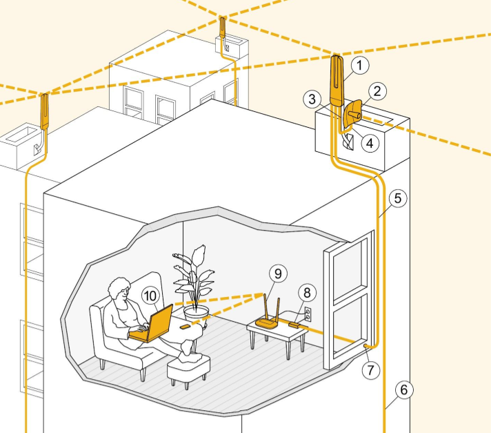

1. Omnidirectional router
2. Point-to-point router
3. Router mount
4. Ethernet cable connecting routers
5. Ethernet cable to main apartment
6. Ethernet cable to additional apartment
7. Hole in wall or window frame
8. Power over Ethernet injector
9. Indoor router
10. Device

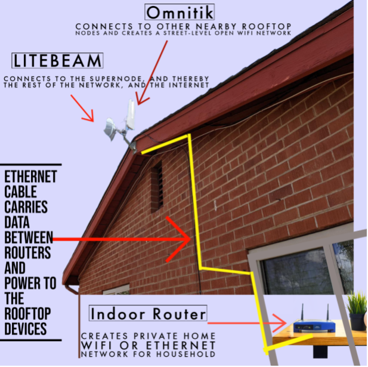

## Before the install date

### Make an install plan 

Once you have done a site survey and have the required routers configured, you may want to develop an install plan before heading to the Installer’s home.

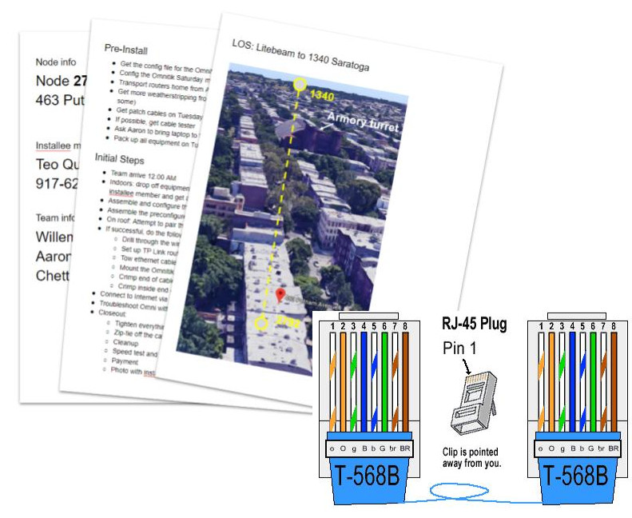

Be sure to check the site survey notes in the Trello card. If any required information is missing, be sure to get it from the people who did the survey, or from the installee member, before scheduling the install.

In your install plan, consider including:

- Installee Member name, address and phone number
- Google Earth screenshots for orienting myself on the roof
- Order of operations (especially for non-typical installs)
- Equipment checklist
- Router login information and passwords that are in Tucson Mesh’s password store 
- Ethernet cable diagram

### Configure routers 

Configure the outdoor routers before the day of the install. Instructions are available in the [Configuring Routers Guide](../configuring-routers/index.md)

It may also be helpful to cross reference NYC Mesh’s [config docs](https://wiki.nycmesh.net/books/3-hardware-firmware/page/config-table-of-contents).

Save offline copies of the config instructions on your laptop for easy reference while on site.

### Make a patch cable to connect the rooftop routers

See the [crimping cable](#crimp-the-cable) section of this guide.

### Charge batteries, easy-to-lose tools and expendables

Check and charge if needed:

- [ ] Batteries for drill
- [ ] Portable battery pack
- [ ] Laptop
- [ ] Phones

Check that frequently used sockets are in the socket set:

- [ ] 1/4" (lag bolts)
- [ ] 8mm (hose clamps)
- [ ] 7mm (hose clamps)

Check other materials that can run out and purchase or order replacements if needed.

### Confirm the installation

Confirm a date with the installer and invite any potential volunteers/installers in training to join you at the install. 

A few days before the install, check the weather. 

The day before the install, send a text to the Installee Member confirming the install (or postponing it if bad weather is predicted). 

Also send a reminder Signal message in the installers thread to confirm the install and remind any potential Installers in training. 

## Install day

### Collect supplies 

Meet at the BCC to collect supplies.

Transport equipment in your car. You will need a car that is able to transport a ladder to the site.

Put equipment in bags to more easily transport equipment up and down ladders on site.

**Tools**:

- [ ] Mallet
- [ ] Drill
- [ ] Screwdriver and ratchet set
- [ ] Drill bits
- [ ] Ethernet crimp kits. Make sure everything is in these kits including cable testers.
- [ ] Stiff wire to use for threading ethernet cable through walls
- [ ] Sharpies
- [ ] Pencils (sharpened)
- [ ] Level
- [ ] Ladder or confirm other means of roof access

**Mounting Materials**:

- [ ] Hardware boxes 
    - [ ] Screws
    - [ ] Washers
    - [ ] Anchors
    - [ ] Cable staples
- [ ] Zip ties
- [ ] Hose clamps
- [ ] Garage door insulation or upcycled bike tube. This is used to mount routers to the mast.
- [ ] Sealant
- [ ] Adhesiver
- [ ] J mount
- [ ] Electrical tape 
- [ ] Duct tape
- [ ] Masking tape
- [ ] Shims
- [ ] Tiny Broom

**Networking**:

- [ ] Ethernet cable (large spool of outdoor-rated cable)
- [ ] Ethernet cable (indoor patch cable)
- [ ] Ethernet cable (outdoor patch cable)
- [ ] OmniTIK with PoE injector and AC adapter
- [ ] LiteBeam
- [ ] Indoor router
- [ ] Laptop
- [ ] USB ethernet adapter
- [ ] Portable battery pack (charged)

**Sun Protection**:

- [ ] Sunscreen
- [ ] Water
- [ ] Hat

**Paperwork**:

- [ ] Onboarding card
- [ ] [Network Commons License](https://www.tucsonmesh.net/principles/network-commons-license)
- [ ] Donation information

### Arrive at the site and go over the plan

After introducing yourself and the team, set down your equipment in a staging area. 

Go over the install plan, especially the locations where you plan to drill into the structure, and where you plan to place the indoor router. Make sure nothing has changed.

### Check the rooftop safety

Before going up on the roof, ask the Installee Member to point out any hazards that are new since the site survey.

Note any hazards identified during the site survey and point them out to the team. These could include things like trip and slip hazards, loose cables and unprotected ledges.

Make sure you follow the [Ladder Safety Protocols](../ladder-safety.md).

For more comprehensive rooftop safety guidance, please read NYC Mesh's [site safety documentation](https://wiki.nycmesh.net/books/2-install-maintenance-guides/page/safety).

If conditions are too unsafe, or become unsafe due to the weather changing or darkness falling, end the install.

### Mount the rooftop routers

#### Existing mast, pipe or railing

This is the fastest and easiest mounting technique.

1. Select an appropriately-sized hose clamp. 
2. Thread the hose clamp through the router mount.
3. Tighten the hose clamp using a screwdriver or drill on screw setting.

Don’t obstruct a fire escape or other means of egress!

#### New J-pipe mounted to surface

We use this mounting method on around half of all installs.

- Hold mount up to surface in position.
- Mark spots for drill holes with a pencil or sharpie and remove mount.
- For harder materials such as block, brick or adobe, use a punch to get drill holes started.
- Drill pilot holes and blow out holes.
- For harder materials such as block, brick or adobe, put adhesive into each pilot hole and push in anchor. Use mallet and/or trim off access to make anchor flush.
- Apply adhesive to back of mount.
- Put mount in place and begin threading in screws by hand.
- Fully screw in screws using drill.
- Attach pipe to mount base loosely with included bolts.

#### New pipe connected to existing pipe

This method can be used to extend the height of an existing pipe or to provide better vertical or horizontal alignment.

#### Mounting to a standalone heavy object

#### New mast

Masts can be free-standing if secured by cinder blocks or sandbags, or can be attached to a wall. Guy wires can be used to increase stability.

This is a less common mounting method, requiring more advance prep.

Do not mount the router upside down! If you do, water will drain into the Ethernet port.

#### Drilling tips

Use a carbide tip bit for masonry and concrete.

Use a cobalt or titanium tip bit for metal and wood.

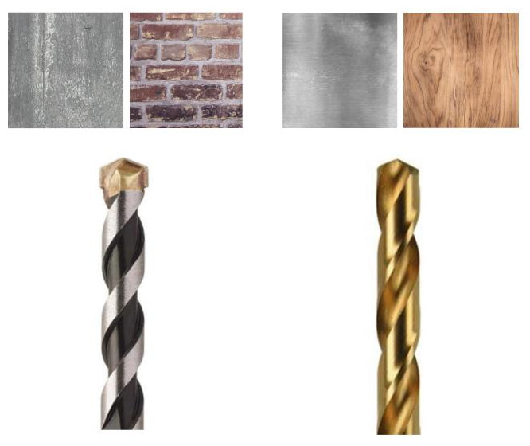

Tips and tricks:

- Wear safety glasses!
- Brick is much easier to drill in than concrete.
- Mark the hole depth on the drill bit with a piece of electrical tape.
- Drill straight into the surface, making sure that the bit does not arc.
- Apply WD-40 to metal as you drill for faster results.
- The drill bit gets hot! Let it cool down after removing from the hole.

Do not drill holes into the horizontal roof surface or water might leak in. Roofs are meant to be watertight!

If you drill into a horizontal concrete or brick surface, make sure to fill the hole with sealant!

#### Router position on pipe or mast

Determine which router would be best positioned at the top of the pole, versus part of the way up. Perhaps the LiteBeam gets better LOS to supernode with a little extra height, or perhaps the Omni can better see another Omni from the top of the J-pipe. In general, prioritize the LiteBeam's line-of-site to the supernode. connection.

Install the lower router first on the pole.

Assemble the rother mounting attachment. Attach a hose clamp and tighten as much as you can while still being ble to slide it onto the J-pipe or mast. Slide the hose clamp onto the J-pipe or mast with a small strip of garage door insulation between the hose clamp and pipe. This helps fold the clamp firmly in place when tightened. If not aligning a LiteBeam, finish tightening the hose clamp.

Repeat these steps for the top router.

### Align the routers

#### LiteBeams and other Ubiquiti routers

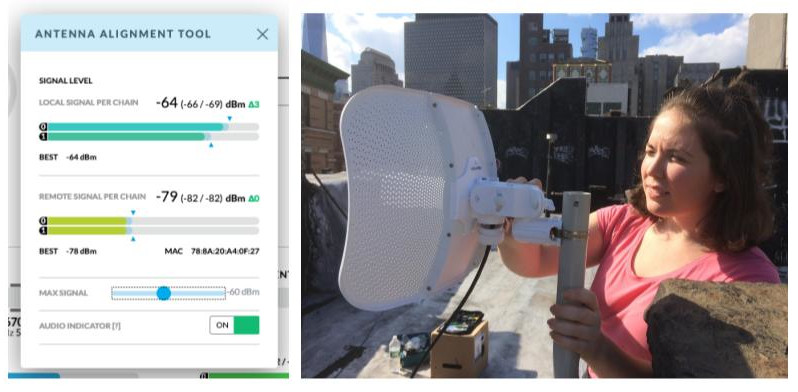

See [Realign your LiteBeam](../realignment/realign-litebeam.md) for detailed instructions.

Use the battery pack and an extra POE injector to power the LiteBeam.

Connect to the management WiFi network and access the admin interface.

The Ubiquiti dashboard and app include an alignment tool. Adjust the max signal level and turn on the Audio Indicator. The higher the tone, the stronger the signal. Rotate the router in small increments to hone in on the best alignment.

Confirm that the signal is similar to what was documented in the Trello card during the site survey.

#### OmniTIK routers

An OmniTIK is omnidirectional and does not need to be aligned.

#### SXT routers

There is no alignment tool. Adjust manually as best you can.

### Configure the preferred mesh hop on the Omni

Set up a preffered mesh hop on the `wlan4` interface to avoid WDS thrashing.

This is optional when there is both a LiteBeam and an Omni, but if the Omni can see multiple other Omnis, it can also help avoid WDS thrashing if the LiteBeam ever goes offline.

Connect to the Omni's wireless network, named `tucsonmesh-<nn>-omni`, where `<nn>` is this node's network number that you selected when configuring the Omni.

Use WinBox, or connect to the IP address corresponding to the network number in your device's web browser.

Click on `Wireless` in the RouterOS web admin and click on `wlan4`.

Type the name of the Omni you want to be preferred into the `SSID` box, replacing `tucsonmesh-xxxx-omni` with the network corresponding to the preferred neighboring Omni's network number. Update the comment field to reference the preferred Omni name.

Click `Ok` and click the `E` icon to the left of the `wlan4` interface entry to enable the interface.

The connection might be momentarily interrupted for Omni-only installs while the router switches from WDS to using the `wlan4` interface.

### Adopt the LiteBeam to UISP

Assign the device to a site/subscriber.

See [Ubiquiti LiteBeam 5AC - Pairing with UISP](../configuring-routers/pairing-lbes-with-uisp.md) for detailed instructions.

### Connect rooftop routers with a patch cable

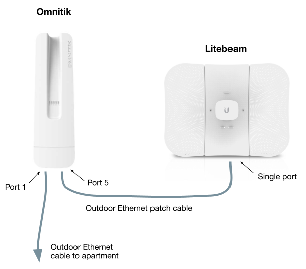

When installing both a LiteBeam and an OmniTIK router, connect the two with a short *outdoor* Ethernet patch cable. 

Do not use an *indoor* Ethernet cable!

### Run cable from the roof to inside the house

Pull out the entire length of cable you need along the exact path it will follow and add extra length for service loops.

Provide a service loop (2-3 loops) on both ends of the cable. Tie it with a ziptie and hang it or tuck it away neatly.

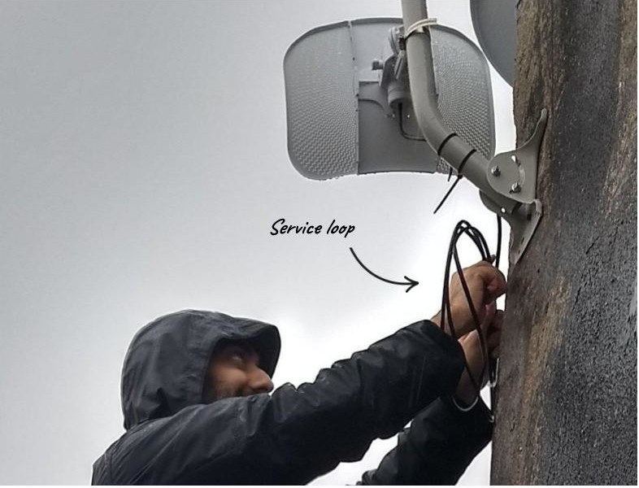

Do not bend the cable too sharply. Maintain at least a 3” curve radius.

Ziptie or nail in cable clips to the cable along its path to secure it to the mount, railings, hooks, existing cables, etc. and keep it out of the way of future roof occupants.

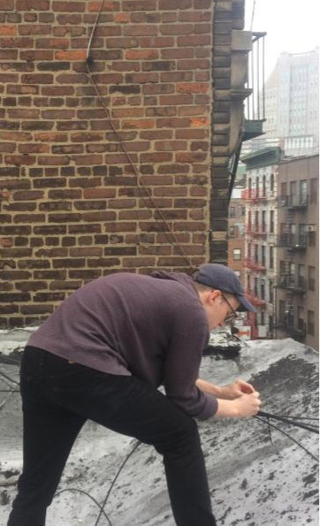

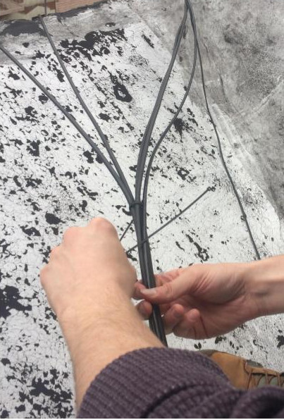

### Pass cable into the house

There are a number of ways to pass the cable into an apartment:

- Existing cable pass or conduit
- Defunct coaxial cable hole
- New hole in window frame
- New hole in wall

Make sure that you discuss and get the Installee Member’s approval before any drilling!

#### Existing cable pass or conduit

1. Pop off the faceplate or remove with a screwdriver.
2. Push or pull the cable through.
3. Reattach the faceplate.

#### Defunct coaxial cable hole

1. Cut the coaxial cable on the outside of the wall, leaving a few inches sticking out.
2. Strip the coaxial cable down to the inner copper wire.
3. Strip the plastic casing off the end of the Ethernet cable.
4. Twist the coaxial copper wire and Ethernet wires together securely.
5. Pull the coaxial cable on the inside of the wall, towing the Ethernet cable with it through the hole.

#### New hole in metal window frame

1. Decide on a hole location at the bottom left or right corner of the frame.
2. Insert a cobalt bit and put the drill on drill (not hammer drill!) mode.
3. Put on safety glasses.
4. Slowly drill into the metal.
5. Sweep up the metal shavings.
6. Lay weather strip along the ledge under the bug screen.
7. Pass the cable through the hole.

### Crimp the cable

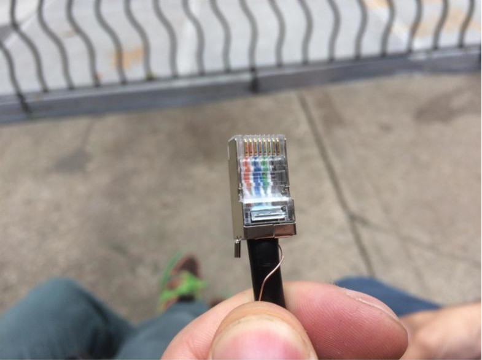

Crimp RJ-45 connectors onto the ends of the Ethernet cable so they can be inserted into the routers and POE injector.

The best way to learn how to crimp is with an experienced installer, but you can NYC Mesh also as an [instructional video](https://www.youtube.com/watch?v=DtnSEbgobfs).

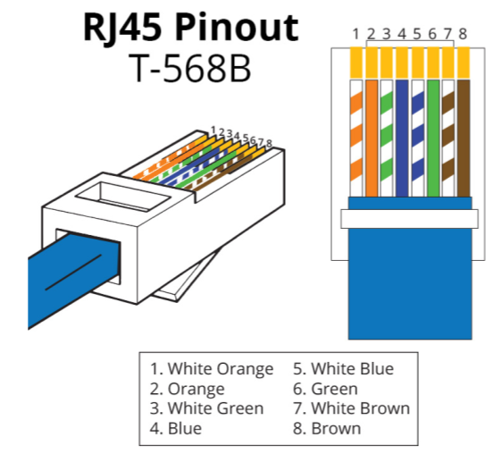

1. Strip 1.5” of sheathing with the cable stripper.
2. Peel away the foil and clear plastic.
3. Bend the ground wire down.
4. Untwist the wire pairs.
5. Straighten the wires by running them against the edge of a hand tool.
6. Arrange the wires in the order shown and jiggle to align.
7. Trim the wires.
8. Slide the wires all the way into the connector. Make sure the black sheathing goes inside.
9. Crimp with the crimp tool!
10. Wind the ground wire through the loop and pinch closed. 

### Test the cable

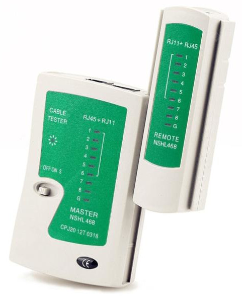

Use a cable tester to ensure you’ve crimped the cable correctly.

Unfortunately, these testers frequently break. Before testing your crimped cable, test an indoor patch cable to ensure the tester is in good working order.

1. Detach the two sides of the tester and connect each to either end of the cable.
2. Switch the tester on (larger part) and check both sides. The numbers should light up in order.
3. Recrimp the cable if it fails.

### Connect ethernet cable

On the roof, connect the ethernet cable to the outdoor router.

If using an OmniTIK, it should go into port 1.

### Connect POE injector

If using only a LiteBeam rooftop router, use the Ubiquiti POE injector. If using an OmniTIK (with or without a LiteBeam router), use the OmniTIK POE injector.

Connect the indoor router, POE injector and cabling as shown.

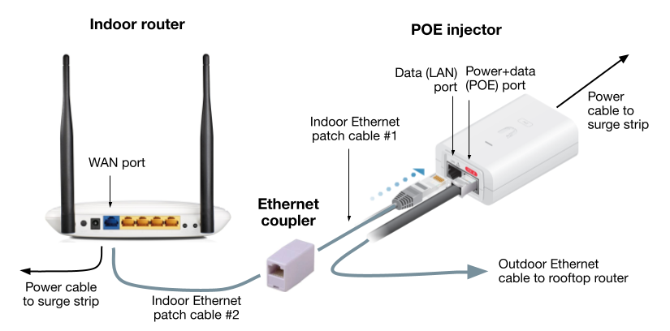

If possible, plug the indoor AC adapter and the rooftop router's POE injector into a power strip with a surge protector. 

**You can also connect the Data (LAN) cord to the WAN port.**

⚠️  Do not connect the TP-Link WAN port to the POE Power+data port or it will fry the router!

Here’s a photo of all of the indoor equipment, including an OmniTIK POE injector, connected together.

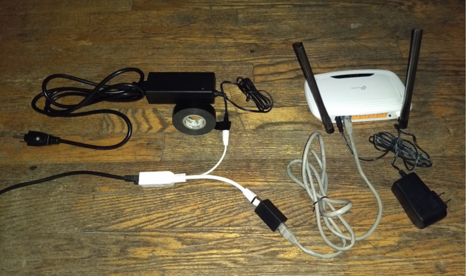

### Configure the indoor router

We provide an inexpensive TP-Link, or similar, indoor router on all volunteer-led installs. The bandwidth and range of this router is limited.

If the Installee Member has a large home, they may need to purchase a more powerful router or home mesh wifi system.

Locate the TP-Link’s SSID and default password on the bottom of the router and connect wirelessly using your laptop. 

Ask the Installee Member to provide you with:

- An SSID name and password for their primary wireless network.
- A username and password to log into the router.
- A password for the router's administrative interface.

Note these, along with the network number of this node, down on the Onboarding Card and give it to them for safe keeping.

Configure the TP-Link following the instructions that came with the router, or the [NYC Mesh docs](https://wiki.nycmesh.net/books/3-hardware-firmware/page/tp-link-indoor-router). 

Confirm that you can connect to the inside router using the SSID and password provide by the Installee Member.

You should now be connected to the Internet! Hooray!

Run an [Ookla speed test](https://www.speedtest.net) and take a screenshot.

### Troubleshoot connection problems

If you are not able to connect to the Internet, troubleshoot starting at the end of the signal path and working your way “upstream.”

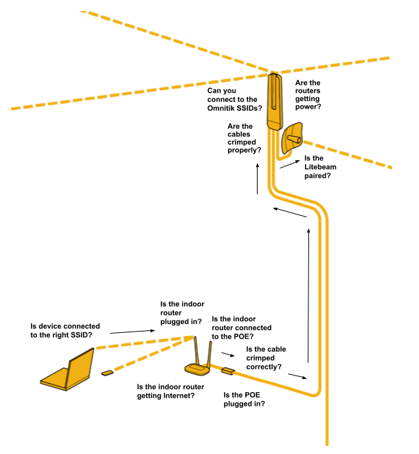

### Connect to Slack

Help the user install the Slack app on their device, or help them access the web version.

Send them an invite to the Tucson Mesh Slack and make sure they can log in.

Add them to the `#user-support` channel.

### Talk about payment

#### Hardware Fee + Monthly Donation

Guide the Installee Member to the [Tucson Mesh donation page](https://donorbox.org/tucson-mesh-seed-money)

**We suggest that people donate between $10-60 every month (or however much they can).**

**If they are able, they can also do a one-time $200 donation for the equipment on their roof.**

Ask them if they have any questions on how to do this donation.

### Take photos

Take photos of the install team, the happy Installee Members with their new equipment (ask permission to post on social media) and the equipment setup.

Don’t wait until the end of the install - take photos as you go to document the process and get some good action shots.

### Cleanup

Tidy as you go and do a final cleanup. Make sure that you have swept up all cable ends, metal shards, bits of plastic, etc. A $1 paintbrush works great for sweeping up small debris.

Bring a plastic bag or two to collect and dispose of trash. Toss cardboard packaging in the recycling bin.

Pack up all of your equipment.

### Promote the mesh locally

Drop off some flyers around the building and around the block

Do a final sweep to make sure you haven’t forgotten anything!

## Post-install

### Update the Trello board

In the Trello card for the installed node, post:

- Speed test results
- Technical photos
- Names of the install team members

Move the card to the `Installed` list.

### Update inventory

Make a shopping list of equipment you need to replenish.

