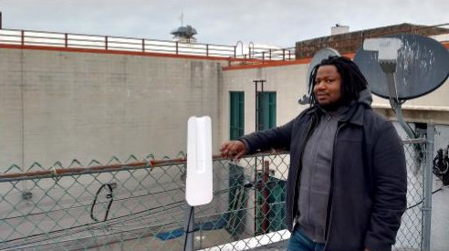

# Installation

## Why become an installer?

- New skills
- Camaraderie and community-building
- Expand the network
- Get outside and enjoy some nice views!
- See the joy on a new member’s face when they get connected!

## Install team members

### Install Coordinator 

- Member of the admin group 
- Confirms additional installers over the installer Signal thread
- Point of contact for the Installee Member
- Plans the install
- Updates the Trello card for the install/node 
- Assembles equipment
- Delegates and teaches tasks during the install
- Maintains a positive, respectful and inclusive attitude
- Watches out for the team’s safety
- Carries out post-install tasks
     
### Installers

- 1-3 on typical residential installs
- State interest in joining the install on the installer Signal thread
- Show up on time and stay the length of the install
- Bring additional equipment if requested
- Support the Install Leader
- Take initiative during the install
- Maintain a positive, respectful attitude

### Installee Member

- At home for the duration of the install
- Ensures a safe route to the roof
- Lets the Installers do their work without too much distraction
- Provides help to the install team if willing, able and requested to do so

## Install process

1. Signup
2. Pre-Install
3. Install
4. Post-Install

### Connecting with Tucson Mesh form

All installs begin with a prospective Installee Member filling out the Get Connected form on the [Get Involved](https://www.tucsonmesh.net/get-involved) page of the Tucson Mesh website.

### Trello card communication

Once the Installee Member fills out the Connecting with Tucson Mesh form, a Trello card is created in the Mesh Installs board. If it is within our range, it goes into the “Ready for Contact & Survey” list.

### Checking line of site

To get connected, the prospective Installee Member must have a line of sight (LOS) to a nearby supernode or node with an omnidirectional router.

The best way to confirm LOS is to do a site survey. Before the site survey, the Install Coordinator can use Google Maps & Google Earth to verify likely LOS.

You can use Google Earth to check line of sight between two locations by following the steps in this guide: [Guide to Google Earth](https://startyourownisp.com/posts/guide-to-google-earth/).

Note that this method is only as accurate as the most recent satellite photos on Google Earth.

### Site survey

If it seems like you are likely to have LOS from Google Earth, move ahead to do a site survey.

The Install Coordinator will contact the Installee Member to set up a site survey.

Make sure you bring the following equipment:

Pre-configured routers or the "Staff of Mesh":

- [OmniTIK](../../hardware/omnitik.md)
- [SXTsq](../../hardware/sxtsq.md)
- [LiteBeam](../../hardware/litebeam.md)

As well as:

- Portable battery pack
- A computer
- An ethernet adapter for the computer if the computer doesn't have a built-in ethernet port 
- PoE injector for each router
- Ethernet patch cord
- Binoculars
- Ladder or other means of roof access

Follow these instructions to check if the signal is strong enough from the Instalee Member’s roof. 

You are aiming for a signal that is stronger than -65 dB signal.

Make sure to:

- Take plenty of pictures of the roof and panoramic pictures surrounding the roof.
- Verify cable passes to the indoors.
- Find optimal locations to affix the routers to the roof and what type of mounting hardware will be required.
- Take a moment to discuss with the Installee what kind of mounting equipment they are comfortable with and options including non-penetrating roof mounts, vent mounts, and J-mounts.

### Router selection

Determine which router(s) you need to connect to a nearby gateway node.

Point-to-multipoint routers such as the [LiteBeam](../../hardware/litebeam.md) or [SXTsq](../../hardware/sxtsq.md) transmit over a long distance but have a narrow beam.

Omnidirectional routers, such as the [OmniTIK](../../hardware/omnitik.md) transmit a signal over a shorter distance but in all directions. 

We often install a LiteBeam and OmniTIK together.

This ensures a strong connection to the Supernode while also providing omnidirectional coverage to the surrounding blocks.

The LiteBeam only has one port. The OmniTIK has five, allowing us to run cable to multiple apartments.

For OmniTIK-to-OmniTIK connections, we also sometimes add an SXT to boost the signal.

### Configuration

Configure the outdoor routers at home. Up-to-date instructions are available in the [Configuring Routers Guide](../configuring-routers/index.md)

It may also be helpful to cross reference NYC Mesh’s [config docs](https://wiki.nycmesh.net/books/3-hardware-firmware/page/config-table-of-contents).

Save offline copies of the config instructions on your laptop for easy reference while on site.

### Install plan

Once you have done a site survey and have the required routers configured, you may want to develop an install plan before heading to the Installer’s home.

In your install plan, consider including:

- Installee Member name, address and phone number
- Google Earth screenshots for orienting myself on the roof
- Order of operations (especially for non-typical installs)
- Equipment checklist
- Router login information and passwords that are in Tucson Mesh’s password store 
- Ethernet cable diagram

### Install confirmation

Confirm a date with the installer and invite any potential volunteers/installers in training to join you at the install. 

A few days before the install, check the weather. 

The day before the install, send a text to the Installee Member confirming the install (or postponing it if bad weather is predicted). 

Also send a reminder Signal message in the installers thread to confirm the install and remind any potential Installers in training. 

### Getting to the site

Meet at the BCC to collect supplies.

Transport equipment in your car. You will need a car that is able to transport a ladder to the site.

Bags are provided to more easily transport equipment up and down ladders on site.

## Install

### Typical setup

1. Omnidirectional router
2. Point-to-point router
3. Router mount
4. Ethernet cable connecting routers
5. Ethernet cable to main apartment
6. Ethernet cable to additional apartment
7. Hole in wall or window frame
8. Power over Ethernet injector
9. Indoor router
10. Device

### Indoor survey

After introducing yourself and the team, set down your equipment in a staging area. 

Discuss with the Installee Member:

- Where they would like to locate their indoor router 
- What cable pass methods are acceptable to them to get into the home
- What methods are appropriate for affixing the routers to the roof (you should have gone over this during the site survey)
- Possible cable runs down to the apartment

### Rooftop survey

Ask the Installee Member to point out any hazards before going up to the roof. 

Once on the roof, identify and point out any safety risks to the team, including trip and slip hazards, loose cables and unprotected ledges.

Make sure you follow the [Ladder Safety Protocols](../ladder-safety.md).

For more comprehensive rooftop safety guidance, please read NYC Mesh's [site safety documentation](https://wiki.nycmesh.net/books/2-install-maintenance-guides/page/safety).

If conditions are too unsafe, or become unsafe due to the weather changing or darkness falling, end the install.

Locate the [supernode](../../networking/supernodes/index.md).

Sometimes the node can be hard to see because it is far away.

You may need to use binoculars to find the pole.

Plan the mounting location and cable run. Consider the following:

- Is there a direct line of sight to the supernode?
- Are there good lines of sight to the surrounding neighborhood?
- Is there an existing mast sturdy enough to mount to?
- Will the router or cabling be in anyone’s way in the future?
- Will the router be easily accessible for maintenance?
- What is the most efficient cable route to the house?

### Signal testing

#### Pairing a Ubiquiti LiteBeam Router 

Complete instructions are in the [Configuring Routers Guide](../configuring-routers/index.md).

1. Turn on the portable battery and plug in the POE injector.
2. Insert one end of a patch cable into the POE power+data port and the other end into the router.
3. Aim the router towards the supernode.
4. Connect to the router’s local wifi SSID on your computer.
5. Navigate to the router’s GUI in your web browser and attempt to pair.
6. To connect to the node gateway, you must get a signal strength closer to 0 dB than -79 dB. Any lower than -79 dB and you should terminate the install.

#### Pairing an OmniTIK Router

Complete instructions are in the [Configuring Routers Guide](../configuring-routers/index.md).

1. Turn on the portable battery and plug in the POE injector.
2. Insert one end of a patch cable into the POE power+data port (not the data only port!) and the other end into port 1 of the router.
3. The OmniTIK will automatically pair with other OmniTIKs in range.
4. Connect to the OmniTIK’s public wifi or node wifi SSID from your computer or phone and do a speed test.

### Mounting

Do not drill into anything until you have confirmed that you are able to connect!

There are numerous ways to mount the routers, including:

- Existing mast, pipe or railing
- New J-pipe mounted to surface
- New pipe connected to existing pipe
- New mast
- Existing window guard
- Improvise

#### Existing mast, pipe or railing

This is the fastest and easiest mounting technique.

1. Select an appropriately- sized pipe clamp. 
2. Thread the pipe clamp through the router mount.
3. Tighten the pipe clamp using a screwdriver or drill on screw setting.

Don’t obstruct a fire escape or other means of egress!

#### New J-pipe mounted to surface

We use this mounting method on around half of all installs.

1. Mark and drill at least four mount pilot holes in the surface.
2. Insert cement anchors and sealant. 
3. Attach the mount with the screws and washers with rubber.
4. Attach the J arm to the mount with the provided bolts.
5. Attach the router with a pipe clamp.

#### New pipe connected to existing pipe

This method can be used to extend the height of an existing pipe or to provide better vertical or horizontal alignment.

#### New mast

Masts can be free-standing if secured by cinder blocks or sandbags, or can be attached to a wall. Guy wires can be used to increase stability.

This is a less common mounting method, requiring more advance prep.

Do not mount the router upside down! If you do, water will drain into the Ethernet port.

### Drilling

Use a carbide tip bit for masonry and concrete.

Use a cobalt or titanium tip bit for metal and wood.

Tips and tricks:

- Wear safety glasses!
- Brick is much easier to drill in than concrete.
- Mark the hole depth on the drill bit with a piece of electrical tape.
- Drill straight into the surface, making sure that the bit does not arc.
- Apply WD-40 to metal as you drill for faster results.
- The drill bit gets hot! Let it cool down after removing from the hole.

Do not drill holes into the horizontal roof surface or water might leak in. Roofs are meant to be watertight!

If you drill into a horizontal concrete or brick surface, make sure to fill the hole with sealant!

### Aligning

#### Ubiquiti Routers

The Ubiquiti dashboard and app include an alignment tool. Adjust the max signal level and turn on the Audio Indicator. The higher the tone, the stronger the signal. Rotate the router in small increments to hone in on the best alignment.

#### OmniTIK

An OmniTIK is omnidirectional and does not need to be aligned.

#### SXT

There is no alignment tool. Adjust manually as best you can.

### Connecting routers

When installing both a LiteBeam and an omnidirectional Omnitik router, connect the two with a short *outdoor* Ethernet patch cable. 

Save time by crimping the patch cable at home before the install (see Install: Crimping).

Do not use an *indoor* Ethernet cable!

### Cable run

Pull out the entire length of cable you need along the exact path it will follow and add extra length for service loops.

Provide a service loop (2-3 loops) on both ends of the cable. Tie it with a ziptie and hang it or tuck it away neatly.

Do not bend the cable too sharply. Maintain at least a 3” curve radius.

Ziptie or nail in cable clips to the cable along its path to secure it to the mount, railings, hooks, existing cables, etc. and keep it out of the way of future roof occupants.

### Cable pass

There are a number of ways to pass the cable into an apartment:

- Existing cable pass or conduit
- Defunct coaxial cable hole
- New hole in window frame
- New hole in wall

Make sure that you discuss and get the Installee Member’s approval before any drilling!

#### Existing cable pass or conduit

1. Pop off the faceplate or remove with a screwdriver.
2. Push or pull the cable through.
3. Reattach the faceplate.

#### Defunct coaxial cable hole

1. Cut the coaxial cable on the outside of the wall, leaving a few inches sticking out.
2. Strip the coaxial cable down to the inner copper wire.
3. Strip the plastic casing off the end of the Ethernet cable.
4. Twist the coaxial copper wire and Ethernet wires together securely.
5. Pull the coaxial cable on the inside of the wall, towing the Ethernet cable with it through the hole.

#### New hole in metal window frame

1. Decide on a hole location at the bottom left or right corner of the frame.
2. Insert a cobalt bit and put the drill on drill (not hammer drill!) mode.
3. Put on safety glasses.
4. Slowly drill into the metal.
5. Sweep up the metal shavings.
6. Lay weather strip along the ledge under the bug screen.
7. Pass the cable through the hole.

### Crimping cable

Crimp RJ-45 connectors onto the ends of the Ethernet cable so they can be inserted into the routers and POE injector.

The best way to learn how to crimp is with an experienced installer, but you can NYC Mesh also as an [instructional video](https://www.youtube.com/watch?v=DtnSEbgobfs).

1. Strip 1.5” of sheathing with the cable stripper.
2. Peel away the foil and clear plastic.
3. Bend the ground wire down.
4. Untwist the wire pairs.
5. Straighten the wires by running them against the edge of a hand tool.
6. Arrange the wires in the order shown and jiggle to align.
7. Trim the wires.
8. Slide the wires all the way into the connector. Make sure the black sheathing goes inside.
9. Crimp with the crimp tool!
10. Wind the ground wire through the loop and pinch closed. 

### Testing cable

You can use a cable tester to see if you’ve crimped correctly. 

Unfortunately, these testers frequently break. Before testing your crimped cable, test an indoor patch cable to ensure the tester is in good working order.

1. Detach the two sides of the tester and connect each to either end of the cable.
2. Switch the tester on (larger part) and check both sides. The numbers should light up in order.
3. Recrimp the cable if it fails.

### Indoor Router Setup

We provide an inexpensive TP-Link indoor router on all volunteer-led installs. The bandwidth and range of this router is limited.

If the Installee Member has a large home, they may need to purchase a more powerful router or home wifi system.

Connect the TP-Link, POE injector and cabling as shown. 

If using only a Ubiquiti rooftop router, use the Ubiquiti POE injector. If using an OmniTIK (with or without a Ubiquiti router), use the OmniTIK POE injector.

If possible, plug the TP-Link AC adapter and the rooftop router's POE injector into a power strip with a surge protector. 

**You can also connect the Data (LAN) cord to the WAN port.**

Here’s a photo of all of the indoor equipment, including an OmniTIK POE injector, connected together.

A power strip with a surge protector is not shown but is recommended.

**You can also connect the Data (LAN) cord to the WAN port.**

⚠️ Do not connect the TP-Link WAN port to the POE Power+data port or it will fry the router!

Using the instructions in the box, set up the TP-Link.

Locate the TP-Link’s SSID and default password on the bottom of the router and connect wirelessly using your laptop. 

You should now be connected to the Internet! Hooray!

Run an [Ookla speed test](https://www.speedtest.net) and take a screenshot.

Configure the TP-Link following the instructions in the [NYC Mesh docs](https://wiki.nycmesh.net/books/3-hardware-firmware/page/tp-link-indoor-router). 

Ask the Installee member to provide you with:

- An SSID name and password for their primary wireless network.
- A username and password to log into the router.

Note these down on the Installee Member Form and give it to them for safe keeping.

### Troubleshooting

If you are not able to connect to the Internet, troubleshoot starting at the end of the signal path and working your way “upstream.”

### Payment

#### Hardware Fee + Monthly Donation

Guide the Installee Member to the [Tucson Mesh donation page](https://donorbox.org/tucson-mesh-seed-money)

**We suggest that people donate between $10-60 every month (or however much they can).**

**If they are able, they can also do a one-time $200 donation for the equipment on their roof.**

Ask them if they have any questions on how to do this donation.

### Photos

Take photos of the install team, the happy Installee Members with their new equipment (ask permission to post on social media) and the equipment setup.

Don’t wait until the end of the install - take photos as you go to document the process and get some good action shots.

### Cleanup

Tidy as you go and do a final cleanup. Make sure that you have swept up all cable ends, metal shards, bits of plastic, etc. A $1 paintbrush works great for sweeping up small debris.

Bring a plastic bag or two to collect and dispose of trash. Toss cardboard packaging in the recycling bin.

Pack up all of your equipment.

### Promote the mesh locally

Drop off some flyers around the building and around the block

Do a final sweep to make sure you haven’t forgotten anything!

## Post-install

### Update the Trello board

In the Trello card for the installed node, post:

- Speed test results
- Technical photos
- Names of the install team members

### Update inventory

Make a shopping list of equipment you need to replenish.

