# DRAFT: Realignment

!!! info "How can this documentation be improved?" 

    - Clarify whether it makes sense to adjust the LiteBeam horizontally or vertically first.
    - Update to reflect realignment from BICAS to Tucson House, especially how to pick which sector router to connect to.
    - Incorporate a protocol for people to get their own login for the LiteBeam's admin interface.

This is a draft guide to help users and installers realign the [LiteBeam](../../hardware/litebeam.md) device on a home rooftop with a [supernode](../../networking/supernodes/index.md). Currently it reflects attempting to realign users after the supernode moved from the old BCC to [BICAS](../../networking/supernodes/bicas.md). Eventually it will reflect realigning devices to point to the [Tucson House](../../networking/supernodes/tucson-house.md) supernode instead.

## Overview

- Gather equipment, install software and credentials. 
- Use free GIS software to orient yourself between the home node and the supernode and check line of site.
- Climb on the roof and use the devices administrative interface to see how changing the vertical and horizontal angle of the device changes the signal strength when connecting to the supernode.

## 1. Gather required materials 
Before you start the realignment, make sure that you have the following equipment and information:
- Password to log into the administration interface of the LiteBeam
    - To get a unique password for your node, message Tucson Mesh Admin on the #user-support channel of the [slack](https://join.slack.com/t/tucsonmesh/shared_invite/zt-1brd69xog-H39i1ncLjRTROtGC78WYbw), or by emailing support@tucsonmesh.net
- WPA password for connecting to the sector router WiFi network
```
!!! warning "not needed"

    -For users doing realignments to Bicas, the WPA password that is already in the LBE will not change.
    -For future realignments to Tucson House, we will need to give users the new WPA password as the Tucson House. 
```  
- Ladder to access rooftop
- Laptop computer or mobile phone with WiFi capabilities and a web browser
- Google Earth
- UISP mobile app (optional)
- Binoculars (optional)

## 2. Review related documentation

It's helpful to review these other pieces of documentation that are referenced throughout this guide. 

- [LBE-5AC-Gen2 Quick Start Guide](https://dl.ubnt.com/qsg/LBE-5AC-Gen2/LBE-5AC-Gen2_EN.html): This has images of the different parts of the LiteBeam device and has the names Ubiquiti uses for the different parts.
- [Guide to Google Earth](https://startyourownisp.com/posts/guide-to-google-earth/): Describes how to do common pre-alignment tasks with Google Earth, such as checking line of site. 

## 3. Use Google Earth to help plan the realignment 

- Confirm the exact location of the LightBeam is on the rooftop.
- Check line of sight between the LightBeam and the supernode using Google Earth. See this [Guide to Google Earth](https://startyourownisp.com/posts/guide-to-google-earth/).
- Note landmarks for helping to align the supernode. Idenfity specific buildings, trees, etc, to avoid so that you can get the clearest line of sight to the supernode.
- Determine which sector router to connect to. Bicas has 3 sector routers that generall point North, East, and South. Best connection can be determined later. 
- Let anyone in the household know that their internet connection will be disrupted during the alignment process.

## 4. Climb on the roof to realign LightBeam

Be sure to observe the [ladder safety](../ladder-safety.md) protocols.

From this step onward, it's helpful to have two people, both for ladder safety and later, so one person can adjust the angle of the device and the other can monitor the signal strength.

## 4.1 Connect to the LiteBeam's management network 

- Unplug the ethernet cable from the LightBeam. Wait a few seconds and plug the ethernet cable back in. This will restart the device.
- Once the LightBeam powers up, a blue light will appear on the bottom of the router's Antenna Feed and a wireless management network will become available. This network has an SSID that begins with `LBE-5AC-Gen2`, for example `LBE-5AC-Gen2:245A4CD44286`.
- Connect to this wireless network on your computer or mobile phone as you would any other WiFi network.

## 4.2 Log into the device's administrative interface

### Computer or mobile browser
 
- Visit [https://192.168.172.1](https://192.168.172.1) in your browser. You may be met with a warning due to the self-signed SSL certificate used for the connection. Bypass this warning. 

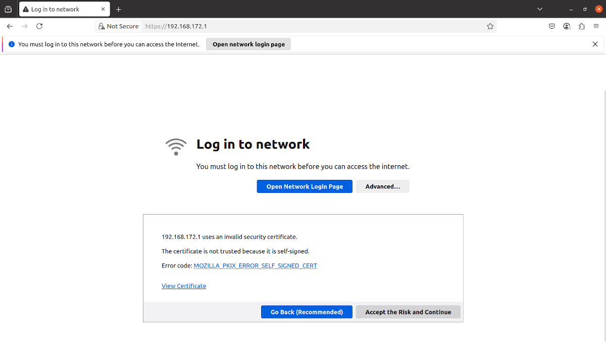

- This will bring you to the administration interface.
- Use the admin username and password you recieved from Tucson Mesh Admin to log into the administration interface.

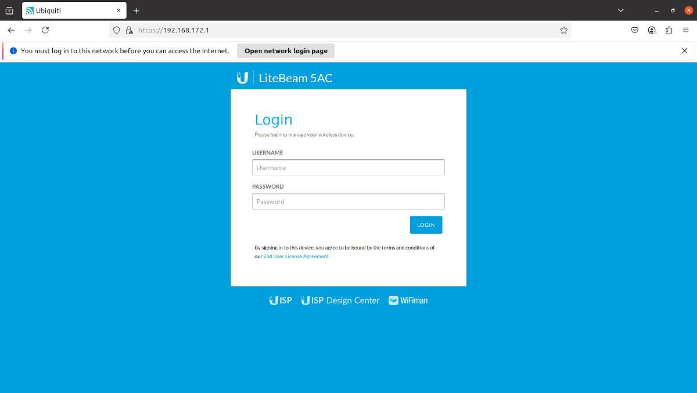

### UISP mobile app

- In the UISP mobile app, after connecting to the management network, in your phone's WiFi settings, open the UISP app and click the `+` button in the bottom menu. 
- Tap the device corresponding to your *network number* in the `Devices` menu.

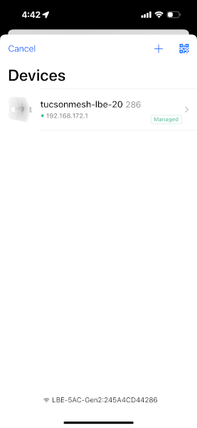

- Log in.

## 4.3 Connect the device to the correct network for alignment

### Comuter or mobile browser

- Once you've loaded the web administration interface, click on the `WIRELESS` icon in the left hand menu. The icon looks like a WiFi symbol. This should take you to the `Basic Wireless Settings` page.

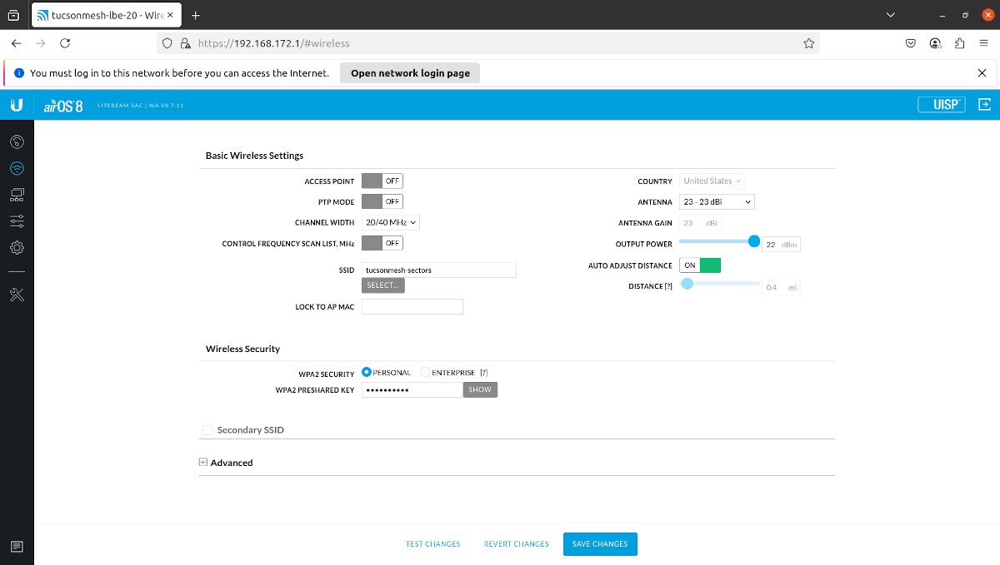

- Make sure the `SSID` setting is set to the network name for the sector router that makes the most sense with your location.
- Make sure that the `WPA PRESHARED KEY` setting is correct. If you need to change it, be sure to click the `SAVE CHANGES` button. 
- If you need to change the network, click the `SELECT` button below the `SSID` input and click the radio button next to the correct network. Then click the `SELECT` button.

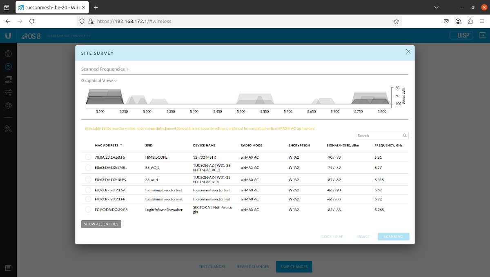

- After you change either the wireless network or the WPA preshared key, you might have to wait a few minutes for the LiteBeam to find the sector router and connect.

### UISP mobile app

- Tap `Configuration` in the bottom menu.
- Check that the `SSID` setting is correct.
- If you need to change it, tap `SELECT`, then tap on the new network name in the list that appears. 

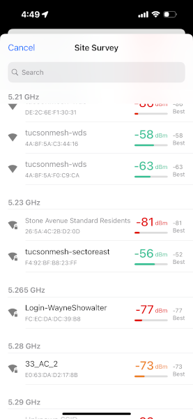

## 4.4 Open the alignment tool

Open the alignment tool and keep it open. You'll monitor this tool as you adjust the position of the LiteBeam.

### Computer or mobile browser

- Click on the `TOOLS` icon in the left-hand menu. And choose `ALIGNMENT` in the menu that pops up.

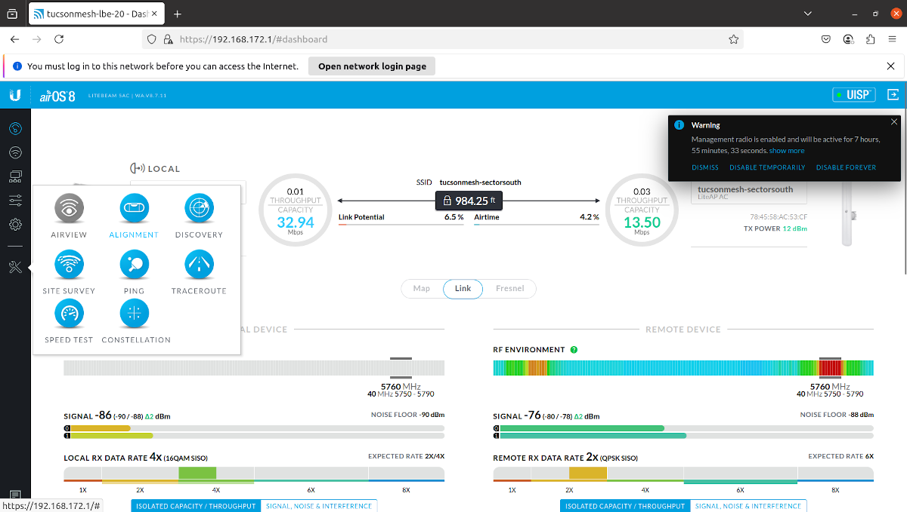

- This will open the `Antenna Alignment Tool`.

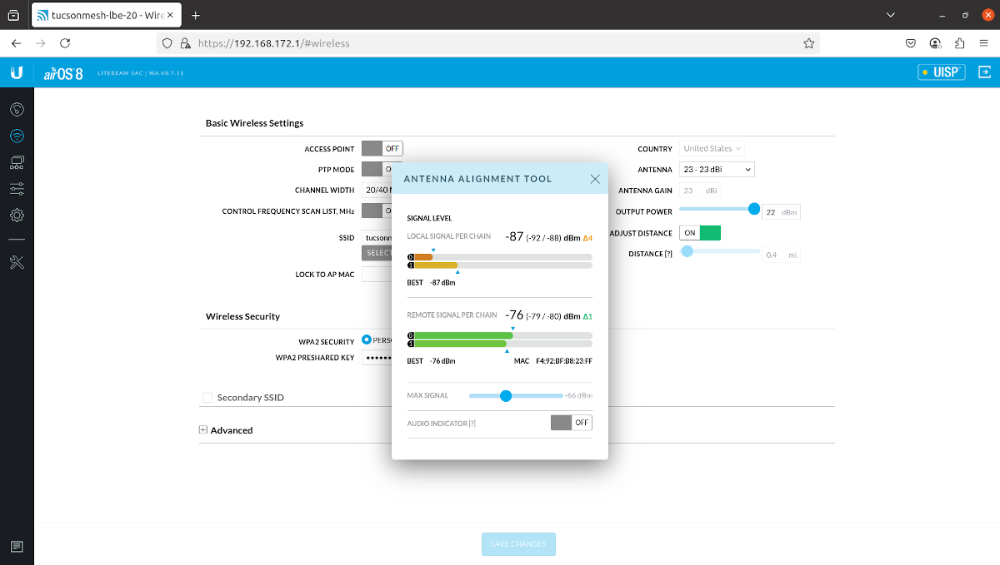

### UISP mobile app

- Tap `Tools` in the bottom menu.

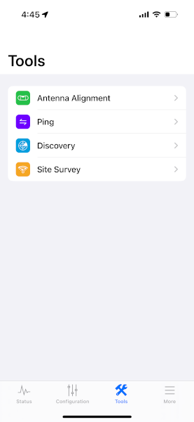

- Tap `Antenna Alignment` in the `Tools` menu.

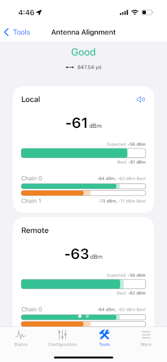

## 4.5 Adjust the LiteBeam position

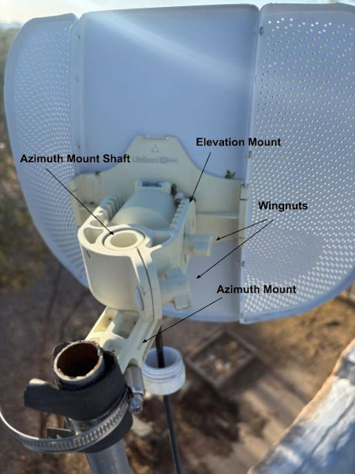

- Loosen the wingnut on the clamp around the *azimuth mount* shaft. This will allow adjusting the horizontal angle of the device.
- The shaft has small ridges and the clamp has small grooves. This makes it difficult to rotate the device around the shaft, even when the clamp is loosened. The best way to rotate the device is to gently raise the device off the shaft until it is just above the shaft. Then rotate it so the next ridge and groove are aligned.
- Adjust the angle of the device one groove at a time and watch for how the signal strength changes. The alignment tool signal strength readings will lag movements of the antenna, so make small movements and wait for the admin interface signal reading to update before adjusting the position further. 
- Keep in mind the landmarks you identified in Google Earth and consult any saved images from the app.
- Look for the position that makes the signal as strong as possible as shown in the web admin interface or UISP app. A signal closer to zero is stronger. I.e. \-68 dBm is stronger than \-70 dBm and \-75 dBm is weaker 
- Now loosen the wingnut on the side of the *elevation mount*.
- Repeat the process of adjusting the vertical angle of the device and watch how the signal strength changes. Stop at the angle with the strongest signal strength.
- Ideally you want a signal \-65 dBm or stronger, but one that is at least \-70 dBm will be workable.
- Tighten the wingnut for the *elevation mount*, then tighten the wingnut for the clamp around the *azimuth mount* shaft.

