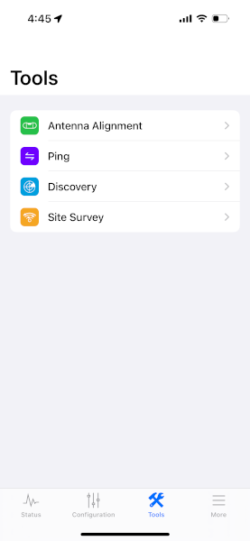

# Realign your LiteBeam using the UISP mobile app 

!!! info "How can this documentation be improved?" 

    - Make sure these instructions match the [ones using the browser interface](realign-litebeam.md)

For these steps, you'll need to be on your roof. Be sure to observe the [ladder safety](../ladder-safety.md) protocols, when climbing up to your roof.

It's also helpful to have two people, both for ladder safety and later, so one person can adjust the angle of the device and the other can monitor the signal strength.

!!! info "Using your device's browser" 

    These instructions use the UISP mobile app to administer your LiteBeam. If you find it easier to use your device's web browser to access the admin interface for your LiteBeam, you can find instructions [here](realign-litebeam.md).

## 1. Review related documentation

It's helpful to review these other pieces of documentation that are referenced throughout this guide. 

- [LBE-5AC-Gen2 Quick Start Guide](https://dl.ubnt.com/qsg/LBE-5AC-Gen2/LBE-5AC-Gen2_EN.html): This has images of the different parts of the LiteBeam device and has the names Ubiquiti uses for the different parts.

## 2. Connect to the LiteBeam's management network 

- Unplug the ethernet cable from the LightBeam. Wait a few seconds and plug the ethernet cable back in. This will restart the device.
- Once the LightBeam powers up, a blue light will appear on the bottom of the router's Antenna Feed and a wireless management network will become available. This network has an SSID that begins with `LBE-5AC-Gen2`, for example `LBE-5AC-Gen2:245A4CD44286`.
- Connect to this wireless network on your computer or mobile phone as you would any other WiFi network.

## 3. Log into the device's administrative interface

- In the UISP mobile app, after connecting to the management network, in your phone's WiFi settings, open the UISP app and click the `+` button in the bottom menu. 
- Tap the device corresponding to your *network number* in the `Devices` menu.

- Log in.

## 4. Connect the device to the correct network for alignment

- Tap `Configuration` in the bottom menu.
- Check that the `SSID` setting is correct.
- If you need to change it, tap `SELECT`, then tap on the new network name in the list that appears. 

## 5. Open the alignment tool

Open the alignment tool and keep it open. You'll monitor this tool as you adjust the position of the LiteBeam.

- Tap `Tools` in the bottom menu.

- Tap `Antenna Alignment` in the `Tools` menu.

## 6. Adjust the LiteBeam position

- Loosen the wingnut on the clamp around the *azimuth mount* shaft. This will allow adjusting the horizontal angle of the device.
- The shaft has small ridges and the clamp has small grooves. This makes it difficult to rotate the device around the shaft, even when the clamp is loosened. The best way to rotate the device is to gently raise the device off the shaft until it is just above the shaft. Then rotate it so the next ridge and groove are aligned.
- Adjust the angle of the device one groove at a time and watch for how the signal strength changes. The alignment tool signal strength readings will lag movements of the antenna, so make small movements and wait for the admin interface signal reading to update before adjusting the position further. 
- Keep in mind the landmarks you identified in Google Earth and consult any saved images from the app.
- Look for the position that makes the signal as strong as possible as shown in the web admin interface or UISP app. A signal closer to zero is stronger. I.e. \-68 dBm is stronger than \-70 dBm and \-75 dBm is weaker 
- Now loosen the wingnut on the side of the *elevation mount*.
- Repeat the process of adjusting the vertical angle of the device and watch how the signal strength changes. Stop at the angle with the strongest signal strength.
- Ideally you want a signal \-65 dBm or stronger, but one that is at least \-70 dBm will be workable.
- Tighten the wingnut for the *elevation mount*, then tighten the wingnut for the clamp around the *azimuth mount* shaft.

