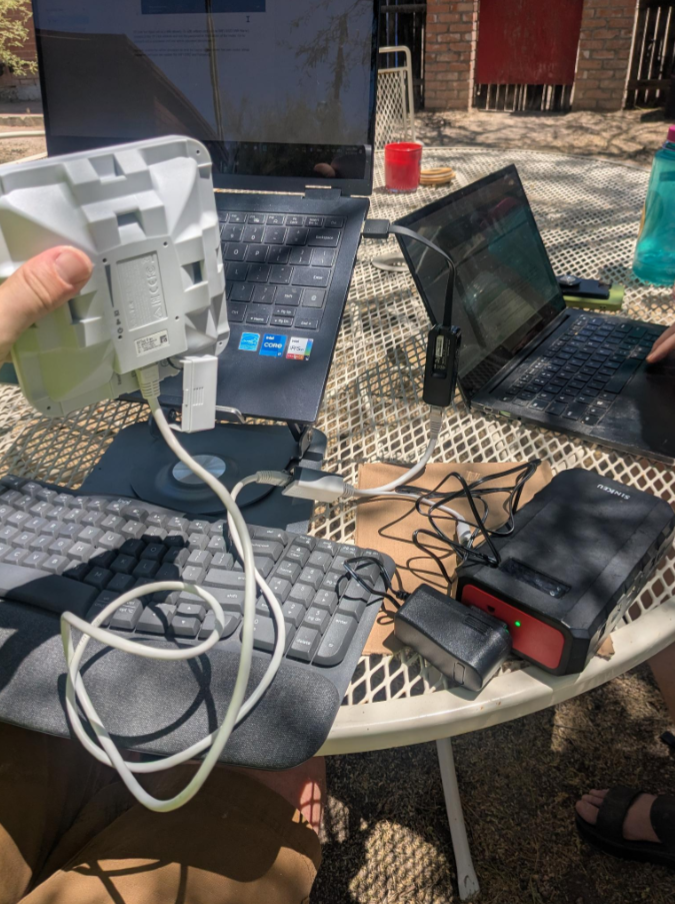
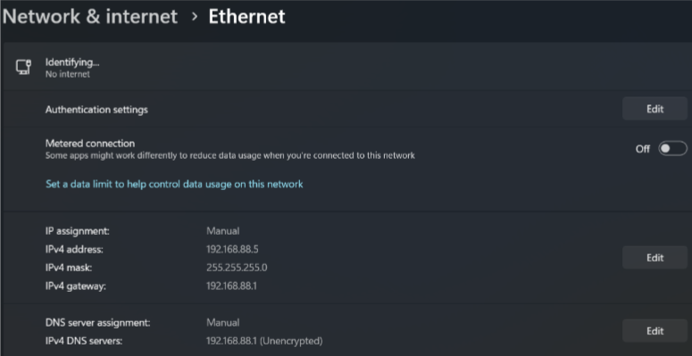
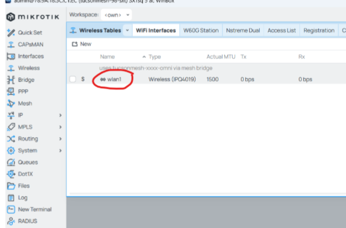
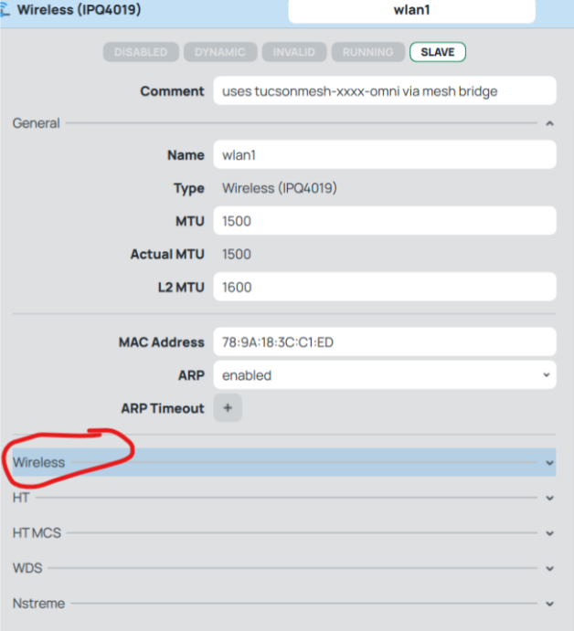
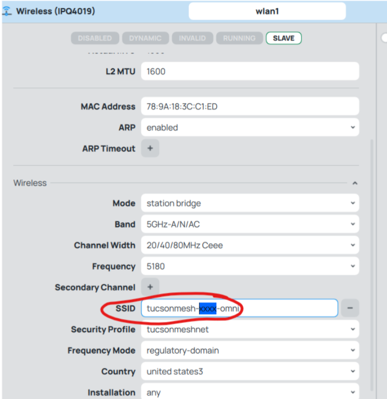
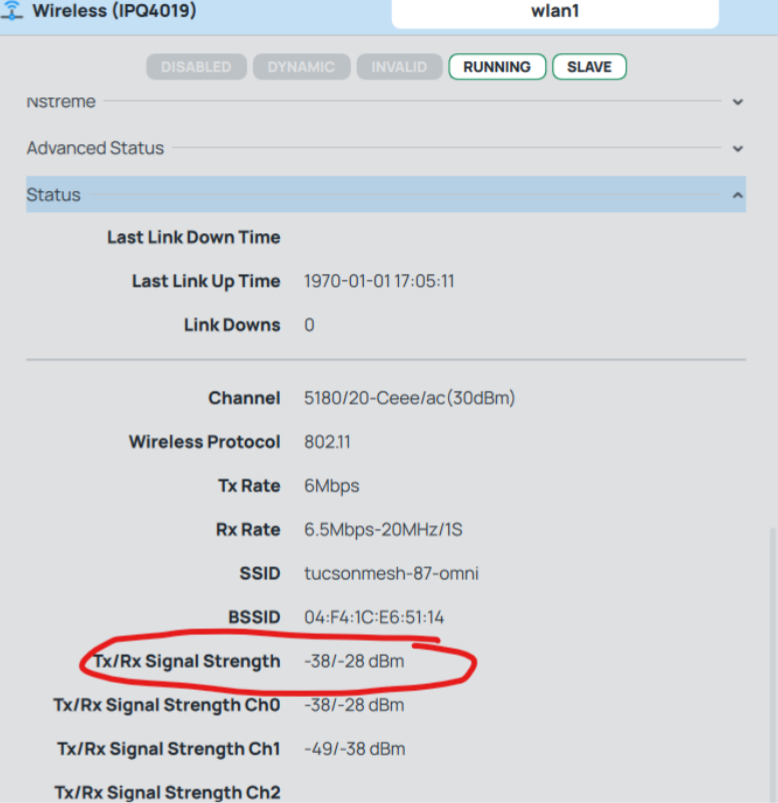

!!! warn "This documentation is in progress"

    This documentation is very work-in-progress and could use a large amount of TLC before it's ready to be called complete.

1. Mount SXT
2. Plug SXT power adapter into Battery Pack, and plug the cord into the PoE injector.
3. Connect a patch cable to the PoE end of the PoE injector and plug it into the SXT to power on the device.
4. Connect the Data cable coming from the PoE injector to your computer (with Ethernet->USB adapter as needed)

5. Go to your computer’s network settings and find the ethernet connection. In the Ethernet Connection’s settings, change the IP Settings to Manual and set your IP Address to 192.168.88.5 and your Default Gateway and Preferred DNS to 192.168.88.1

6. Open WinBox and wait for the SXTsq to appear in your Neighbors display. Double-click the MAC Address for the SXTsq and then Connect.
    
!!! info "Note!"

    If the SXTsq doesn’t show up in your neighbors display, maybe try switching your IP settings for the Ethernet connection back to Automatic/DHCP?

7. Click on the Wireless tab in the SXT’s menu. Double click “wlan1” to edit the Wireless interface

8. Open the Wireless Drop-Down

9. In the SSID field, between the dashes in the middle of the tucsonmesh-XXXX-omni SSID, enter the number of the node you want to connect to. e.g. tucsonmesh-94-omni to connect to the Omni on Node 94

10. Open the Status Dropdown to check that it is connected and see the Signal Strength of the current connection. Watch these numbers (TX/RX Signal Strength) as you adjust the alignment of the SXT until you get the strongest signal (lowest numers) possible.

The “Running” Box at the top will be white (not gray) when the connection is up.

11. Once it is well-aligned, you can unplug everything. The PoE injector will now be plugged in inside the house, with the “Data” cable plugged into the Homew Router’s WAN (Internet) Port. From the PoE Out port on the PoE Injector, a cable will run out of the house to the SXT on the roof.
