# Site survey

!!! info "How can this documentation be improved?" 

    - Check that menu labels referenced in the router admin interfaces are correct. 
    - Explain how to read the signal strength in the Omni instructions.
    - Better describe sector router configuration prior to the site survey.

## Equipment needed

- Pre-configured routers or the "Staff of Mesh"
  - [OmniTIK](../../hardware/omnitik.md)
  - [SXTsq](../../hardware/sxtsq.md)
  - [LiteBeam](../../hardware/litebeam.md)

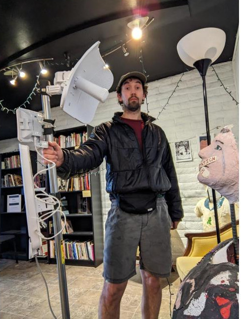

- Portable battery pack
- A computer
- A USB ethernet adapter for the computer if the computer doesn't have a built-in ethernet port 
- PoE injector for each router
- Ethernet patch cord
- Binoculars
- Ladder, or confirm with the installee that they have a ladder or other means of roof access
- Credentials for logging into the administrative interfaces of routers
  - The default LiteBeam administration credentials are stored in the password manager as `Ubiquiti LiteAP/LBE admin`.
- WPA password for connecting to the Omni's `tucsonmesh-NN-omni` wifi network

## Before the survey

### Check line-of-sight (LOS) with GIS tools

Before the site survey, you can use Google Maps & Google Earth to verify whether there is a likely LOS.

You can use Google Earth to check line of sight between two locations by following the steps in this guide: [Guide to Google Earth](https://startyourownisp.com/posts/guide-to-google-earth/).

Note that this method is only as accurate as the most recent satellite photos on Google Earth.

If there are obstructions, communicate to the installee that there could be problems with a connection, and use what you saw in the sattelite images to plan the locations on the roof where you'll check router signal strength.

If possible, review existing nodes on a map and see if there are nearby nodes that could provide a connection if there is not line of sight to a supernode or if we just want to minimize the hardware used for this install.

### Check and update the channel of the sector router

Particularly if the sector that this location is likely to connect to does not have many existing users, consider making sure that the sector is not in a DFS band and increasing the power. This ensures that the signal you get during the site survey reflects the best possible connection. 

## Introduce yourself and discuss roof access 

1. Arrive at installee’s home. 
2. Introduce yourself.
3. Find a safe place to position the ladder.
4. Ask the Installee Member to point out any hazards before going up to the roof. 
5. Climb up on the roof carefully using the [ladder safety protocol](../ladder-safety.md).  
6. Once on the roof, identify and point out any safety risks to the team, including trip and slip hazards, loose cables and unprotected ledges.

For more comprehensive rooftop safety guidance, please read NYC Mesh's [site safety documentation](https://wiki.nycmesh.net/books/2-install-maintenance-guides/page/safety).

If conditions are too unsafe, or become unsafe due to the weather changing or darkness falling, end the site survey.

## Identify rooftop locations with good line of site and mounting options

Once on the roof, use the binoculars if needed to see which areas of the roof have good line of sight (LOS) to a Tucson Mesh [supernode](../../networking/supernodes/index.md). You may need to use binoculars to find the mast.   

In those areas, look for ways the routers can be easily mounted.

There are numerous ways to mount the routers, including:

- Existing mast, pipe or railing
- New J-pipe mounted to surface
- New pipe connected to existing pipe
- New mast
- Existing window guard
- Improvise

Keep in mind:

- Is there an existing mast sturdy enough to mount to?
- Will the router or cabling be in anyone’s way in the future?
- Will the router be easily accessible for maintenance?
- What is the most efficient cable route to the inside of the house?

Photograph mounting options and make sure when you test the signal strength that you do so close to the location and height where the router would actually be mounted.

### Existing mast, pipe or railing

This is the fastest and easiest mounting technique.

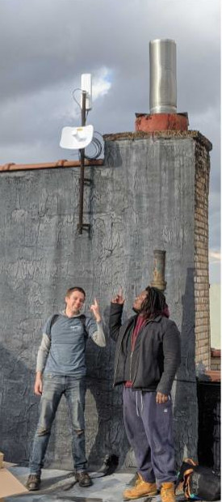

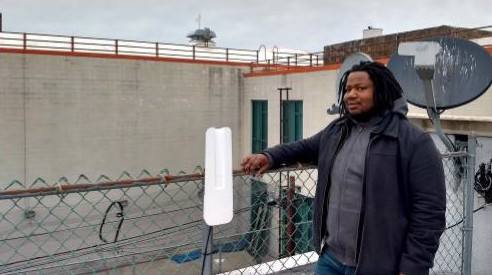

### New J-pipe mounted to surface

We use this mounting method on around half of all installs.

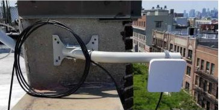
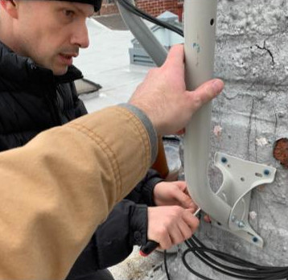
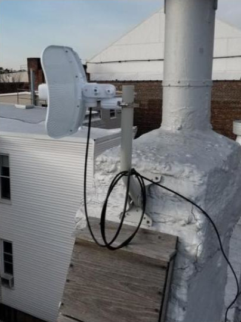

### New pipe connected to existing pipe

This method can be used to extend the height of an existing pipe or to provide better vertical or horizontal alignment.

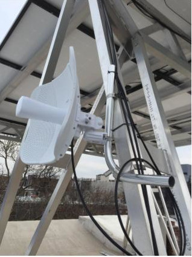

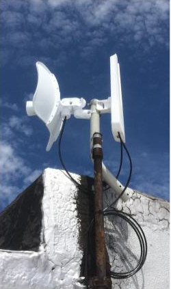

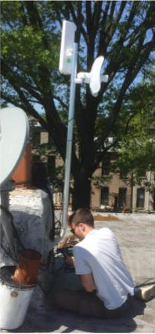

### Mounting to a standalone heavy object

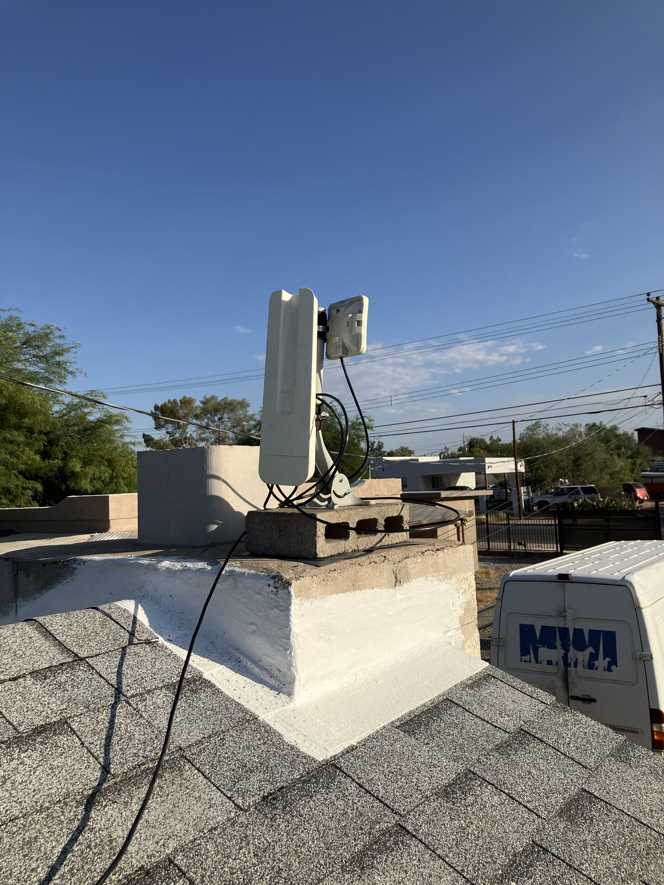

### New mast

Masts can be free-standing if secured by cinder blocks or sandbags, or can be attached to a wall. Guy wires can be used to increase stability.

This is a less common mounting method, requiring more advance prep.

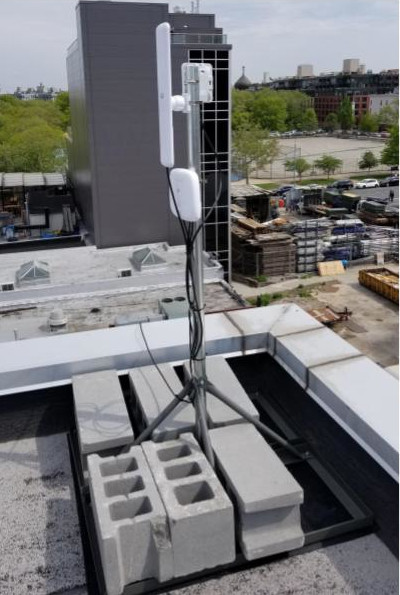

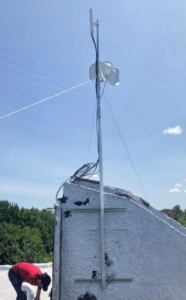

## Check signal strength 

### LiteBeam: Line-of-sight to supernode

1. Turn on the portable battery and plug in the POE injector.
2. Insert one end of a patch cable into the POE power+data port and the other end into the router.
3. Once the router powers up, a blue light will appear on the router and it will generate a management wifi SSID that looks something like `LBE-5AC-Gen2`.   
4. Connect to the network by navigating to https://192.168.172.1 in your browser. You may be met with a warning due to a self-signed security certificate. Bypass this warning. This will bring you to a login page for the LiteBeam administrtion interface. 
5. Type in the admin username and password to log into the LiteBeam administration interface.
6. Click on the site survey tool in the left-hand navigation bar.
7. Click the scan button. Look for the supernode sector device that has the best connection and make a note of its SSID.
8. Navigate to `Wireless Settings` and make sure the `SSID` is the one for the sector router with the strongest signal that you identified in the previous step. 
9. Make sure that the WPA Password is correct.
10. Click the button to apply changes. 
11. After you check these, you might have to wait a few minutes for the LiteBeam to find the Sector Router and connect.   
12. Go to Tools and Alignment or “Align Antennae”  
13. Hold the LiteBeam and point it in the direction of the supernode. Be sure to hold it close to the location and at the height of the mounting location that you had previously identified. 
14. Slowly adjust the angle of the router. Start with the horizontal position. Once you find the strongest signal, adjust the vertical angle from that position.
  - You will need to find a signal that is at least \-70 or higher.
  - Any signal lower than that will not be strong enough to move on to the install.
  - Once you install, you will be able to make a more precise alignment of at least \-65 or higher.
15. Take a screenshot or otherwise note the signal strength. If you plan on taking multiple readings, it's helpful to annotate the screenshot with the location on the roof.
16. Navigate to [speedtest.net](https://speedtest.net) and perform a speed test. Take a screenshot or otherwise note the speed. If you plan on taking multiple readings, it's helpful to annotate the screenshot with the location on the roof.

Repeat this process if there are multiple potential mounting locations.

### Omni: Line-of-site to neighboring node 

1. Turn on the portable battery and plug in the POE injector.
2. Insert one end of a patch cable into the POE power+data port (not the data only port!) and the other end into port 1 of the router.
3. You will see a wifi network called `tucsonmesh-20-omni`. Connect to this network on your computer or phone.
4. Navigate to `http://10.69.0.20/` in your browser. This will take you to the web interface GUI for the Omni.  
5. If it asks you to change password, ignore it.  
6. Click on the `WebFig` tab in the top right corner of the page.
7. Click through the following menu items starting with the menus on the left side of the interface: `Wireless` \> `Wifi interfaces` \> `scanner`. 
8. Make sure you change `interface` to `wlan3` before scanning.
9. To select an Omni to connect to, close out the scanner, navigate to `Wireless` \> `WiFi Interfaces`, click on `wlan4`, and edit the SSID to match the SSID of the Omni you want to connect to.  
10. Navigate to [speedtest.net](https://speedtest.net) and perform a speed test. Take a screenshot or otherwise note the speed. If you plan on taking multiple readings, it's helpful to annotate the screenshot with the location on the roof.

Repeat this process if there are multiple potential mounting locations.

## Identify cable pass and run locations

If it seems possible to get a good connection, get off the roof, and walk around the exterior of the building to plan how the ethernet cable that provides power to the rooftop routers and the internet connection to the inside of the building will be routed and how it will enter the building.

Look for existing holes used by prior cable TV or internet, sattelite connections or other cables that are no longer used or are large enough to accomodate the new ethernet cable.

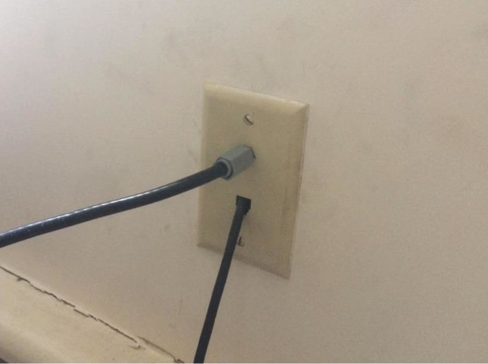

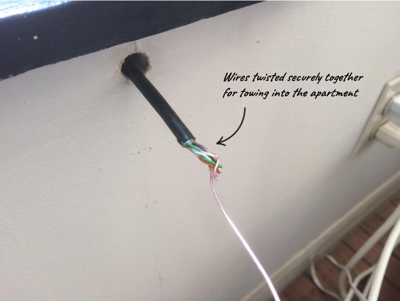

Look for window frames where it would be easy to [drill a hole](https://wiki.nycmesh.net/books/2-install-maintenance-guides/page/window-drilling-guide). 

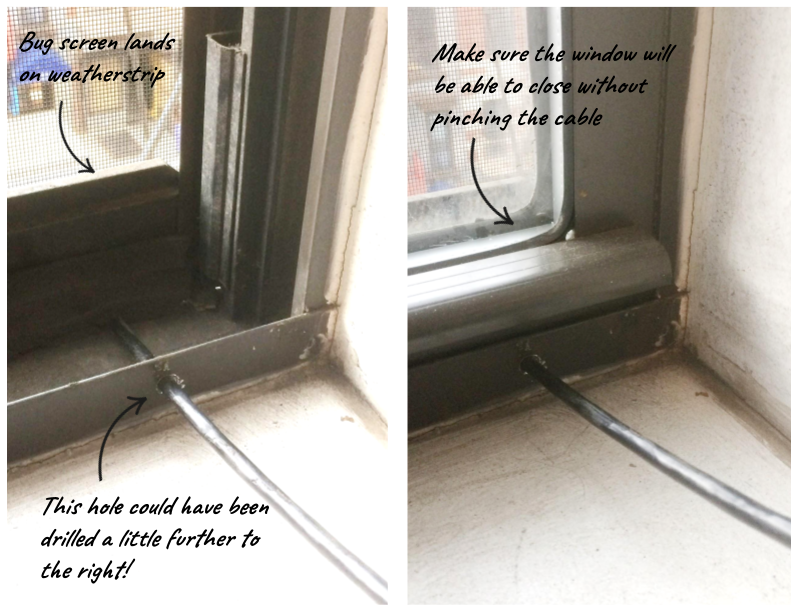

It's also possible to drill a new hole into the building, but it's important to note the material, thickness and any hazards.

There are [weatherproof flat ethernet cables](https://www.waveform.com/products/ethernet-window-entry-cable) that can pass under most windows, but these are somewhat expensive, and would require help through an install donation from the installee.

Be sure to take photos of that show:

- The ideal entry point for the cable.
- The thickness of the materials into which installers will drill.
- The materials into which the installers will drill, especially any damaged or structurally weak areas to avoid.
- Electrical wiring and anything else to avoid when drilling.

Talk to the installee about which locations you think are the most viable and ask if they have any concerns.

## Identify indoor router placement 

Discuss with the installee:

- Where they would like to locate their indoor router 
- How the ideal location lines up with easy ethernet cable passes identified when looking outside
- Whether they have an accessible electrical outlet to plug in their indoor router
- Whether they've had trouble with wifi reaching certain parts of their house
- Which areas of the house should be prioritized for strong wifi access

## Document the survey results 

Update the Trello card for this potential install with as much information as possible, including:

- Photos of potential rooftop mounting locations.
- Photos of any rooftop hazards.
- Photos of the line of site to the supernode or neighboring nodes from those locations.
- Screenshots or notes showing signal strength.
- Screenshots or notes showing speed test results.
- Photos of viable cable pass locations.
- Photos showing viable cable run paths.
- Photos showing any materials that will have to be drilled.
- Routers that will be needed for the install based on line of site and signal strength testing.

### Router selection

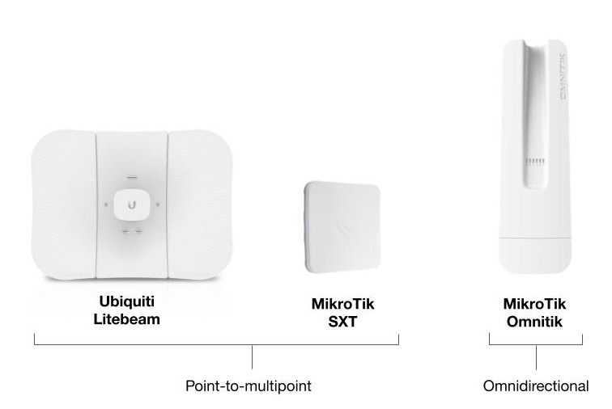

Point-to-multipoint routers such as the [LiteBeam](../../hardware/litebeam.md) or [SXTsq](../../hardware/sxtsq.md) transmit over a long distance but have a narrow beam.

Omnidirectional routers, such as the [OmniTIK](../../hardware/omnitik.md) transmit a signal over a shorter distance but in all directions. 

We often install a LiteBeam and OmniTIK together.

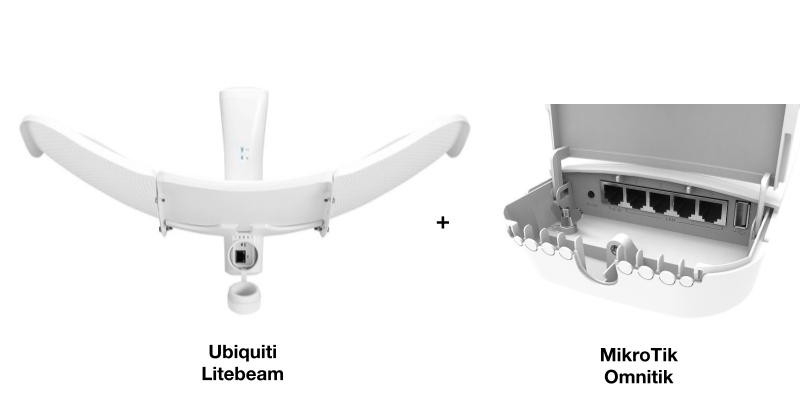

This ensures a strong connection to the Supernode while also providing omnidirectional coverage to the surrounding blocks.

The LiteBeam only has one port. The OmniTIK has five, allowing us to run cable to multiple apartments.

For OmniTIK-to-OmniTIK connections, we also sometimes add an SXT to boost the signal.

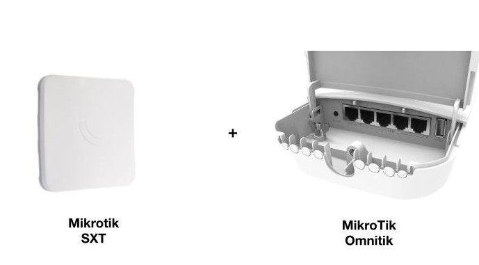

## Check in with the installee

- Let them know whether or not you were able to get a viable signal.
- Show them the optimal locations where you want to place the router on the roof and what kind of mounting hardware could be used, including non-penetrating roof mounts, vent mounts, and J-mounts.
  - Make sure the installee is comfortable with any drilling into the structure that is required to use a particular mount.
- Show them viable cable passes to the indoors.
  - Make sure they are comfortable with any drilling into the structure needed for the cable pass.
- Get a sense of whether they're ready to move forward with an install or need more time to decide.
- Give them a rough timeline for when you'll check in with them to schedule the installation or check on their decision.

## You're done

You can now think about planning the [installation](../installation/index.md)\!*
