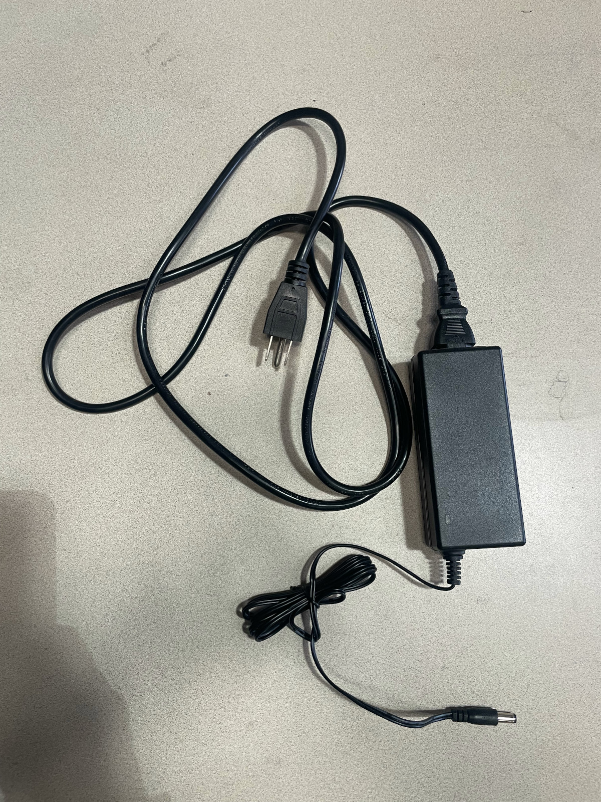
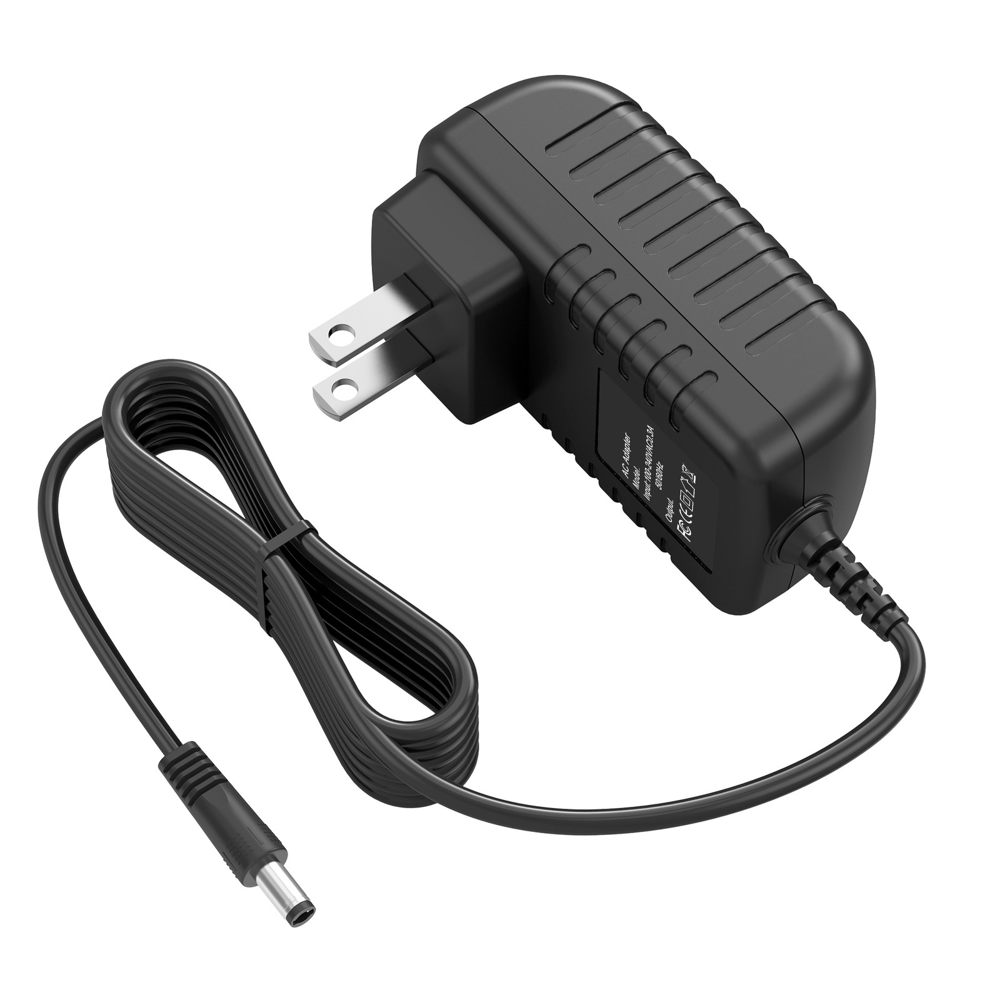
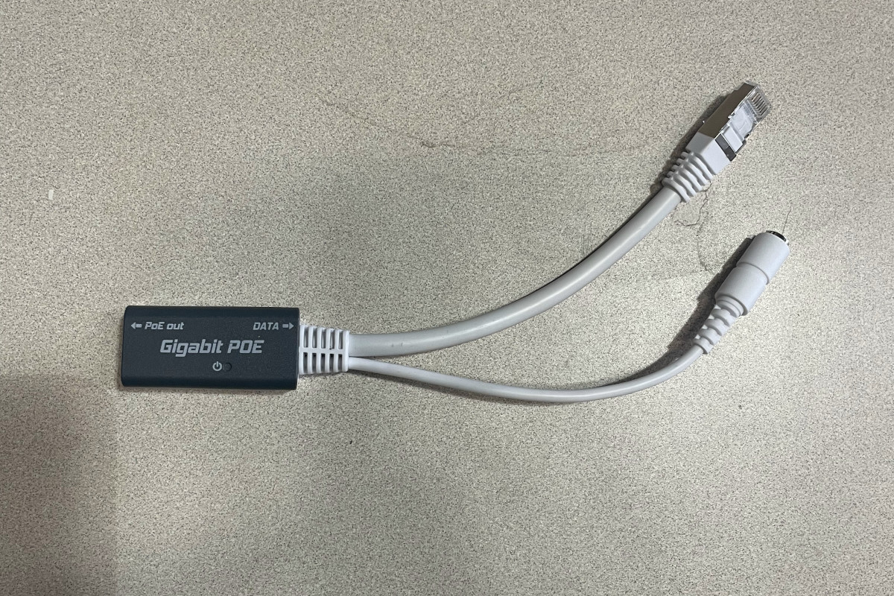

# Power Cycle Routers and Check Avaiable Networks

## "Just turn it on and off"

A shocking array of issues can be resolved by power cycling your equipment. This is also a great chance to make sure you haven't accidentally unplugged the power to your equipment.

Most installs have two sets of AC adapters that you need to unplug and plug back in.

The rooftop routers get power from an AC adapter that looks something like this:

The indoor router will have an AC adapter that looks something like this:

You should unplug the power cable or brick for both your inside and outside routers, wait a few seconds, and plug them back in.

After a couple of minutes, you should see your wireless networks come back up.

## Check Available Wireless Networks

For most network nodes, you should see three networks:

1. The network name (SSID) you chose for your inside network.
2. The network for the OmniTIK, one of the routers on your roof. This will be named `tucsonmesh-NN-omni` where NN is your network number. For example, `tucsonmesh-90-omni`.
3. The free wireless network, `Tucson Mesh Free Wifi`.

### If you don't see your inside network

Check the power LED on your inside router.

### If you don't see the Omni or free networks

Check that the ethernet cable that runs from the outside is plugged into the `PoE out` port of the Omni PoE injector, which looks like this:  

If everything is connected, and the Omni and free networks don't show up, there could be a problem with the AC adapter, the PoE injector or the cable. Contact Tucson Mesh support to get someone to come with the equipment to test these things. 

### If you do see the Omni and free networks

This means that the networking equipment is getting power.

Try connecting to the free network.

## Connect to the free network

Connect to the `Tucson Mesh Free Wifi` network. Since this network is shared by a router on your roof, you may need to step outside to connect.

Can you access web pages or other internet resources? If so, this means your connection to the mesh isworking and the issue is with the inside router.

If not, this means the problem is likely with the connection from your roof to the rest of the Mesh.

In either case, contact Tucson Mesh for further support troubleshooting your connection.

