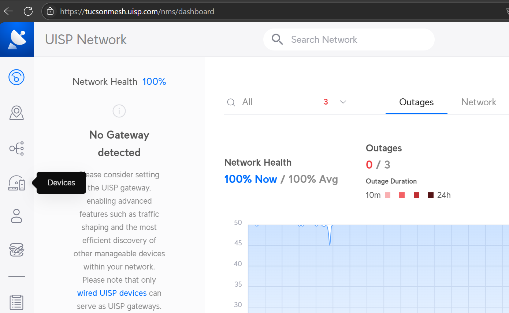
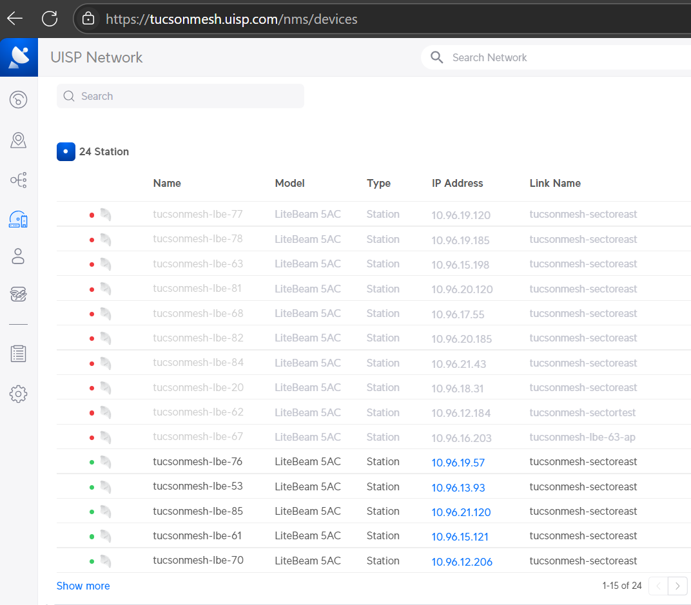
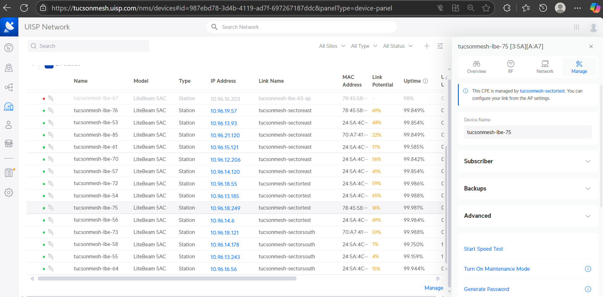
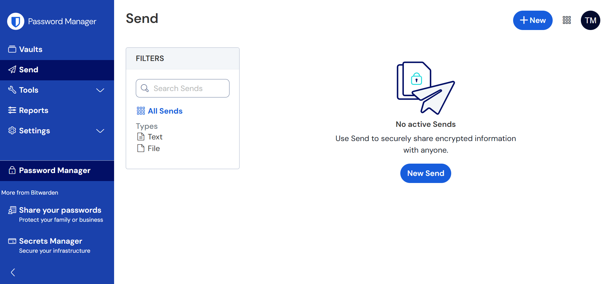
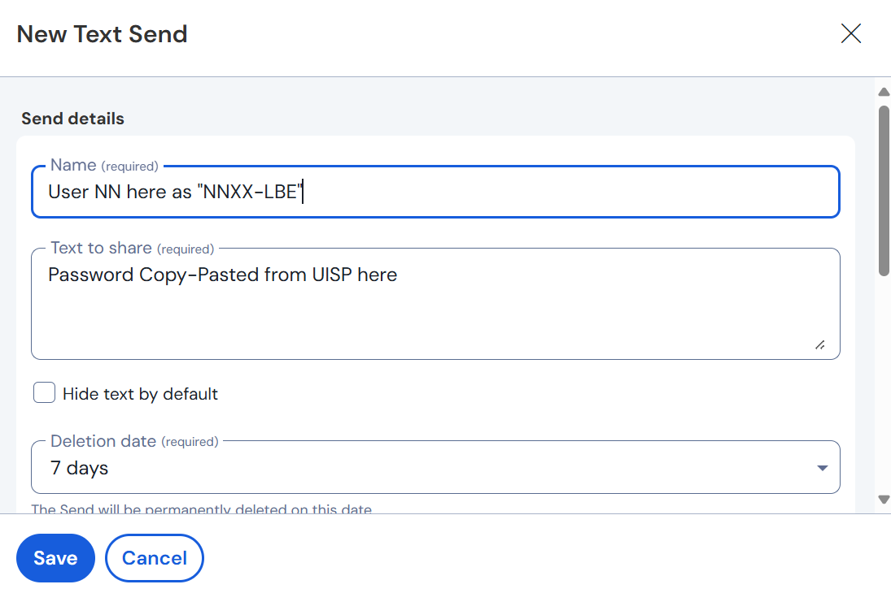
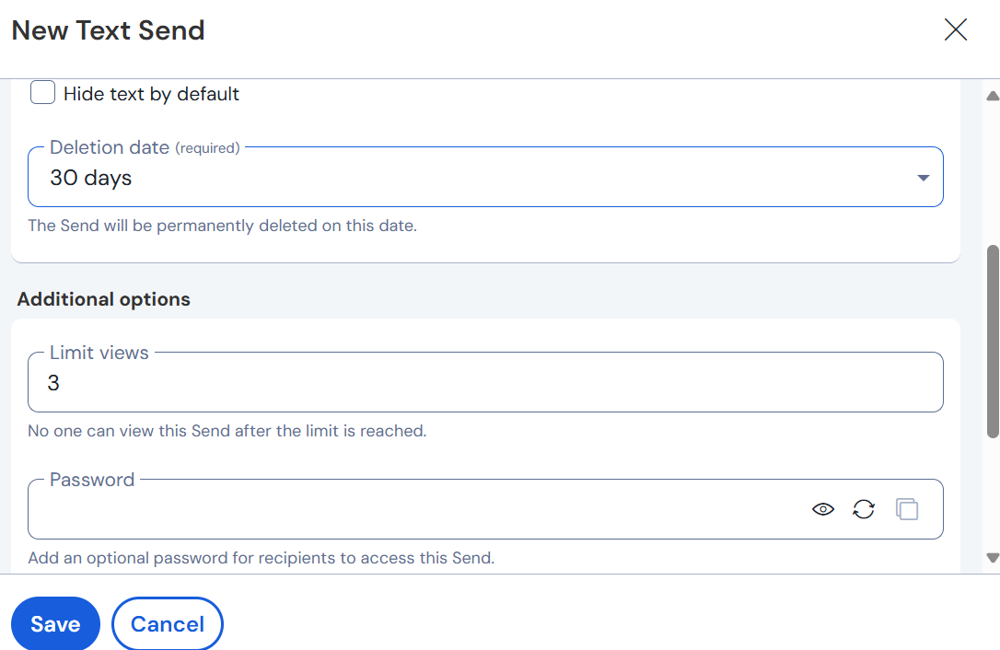

# Set user passwords on their LightBeam

This guide is for Tucson Mesh Admin team members to give users unique passwords for accessing the admin interface of their [LiteBeam](../../../hardware/litebeam.md) (LBE) devices. This is needed to access the tools used for tasks such as [realignments](../../realignment/index.md).

When users want to do a realignment themselves, they will request an admin password for their LBE via the [\#user-support](https://tucsonmesh.slack.com/archives/C03P19L1WBF) channel in the [Slack](https://tucsonmesh.slack.com/). It is possible that these requests may come in through email or other channels as well. Only Admin team members have access to UISP, and it is only through UISP that passwords for LBEs can be set.

## Required materials

- Login credentials for Tucson Mesh Bit Warden  
- Login credentials for Tucson Mesh’s UISP instance 
  - Ability to access the multi-factor authentication method, if required
- Login credentials for Trello
- Contact information for user requesting new password

## Gather information about user and node

Find the network number (NN) for the user who is requesting a new password for the LBE to do a realignment. Use the [Mesh Installs](https://trello.com/b/q0fcwjCM/mesh-installs) Trello Board if the user does not know their NN.

## Assign a new password in UISP

Navigate to [UISP](https://tucsonmesh.uisp.com/) in your browser.

Log in with an account with administrator privileges. This works best in your browser, not the mobile app.

Click on the `Devices` icon in the left-hand menu.

Find the LBE assigned to the NN that you want to update the password for in the `Stations` section of the `Devices` panel. You may need to hit the `Show more` button to see all LBEs. 

Click on the LBE in the list. Then click the `Manage` tab in the panel that opens on the right-hand side of the window.

Click `Generate Password`.

Copy the password as you'll need to paste it into the password store in the next step.

## Store the password in the password store 

!!! warning "Clarification needed" 

    - Specify what to click to create a new password in BitWarden.
    - Specify how to label or organize the LBE passwords so they are all grouped together in BitWardnen.

Store this password in BitWarden.

## Send the password to the user

Share this password with the user via BitWarden’s [Send](https://bitwarden.com/products/send/) feature.   

Create a new "Send".

Write the `Name` as “NNXX-LBE”, replacing the XX with the user's NN, and put the password that you generated in UISP in the `Text to share` text area.

Set the `Deletion date` to 30 and `Limit views` to 3. Make sure the `Password` field is empty. Note that this field sets a password that is required to view the sent item, not the password being shared.

Save the Send by clicking the `Send` button.

Copy the link, and send the link to the user.

## Update the Trello card 

!!! warning "Clarification needed" 

    - Specify what label to use to indicate a password has been set. 

Navigate to the Trello card for the node and add a label indicating that this node now has a unique password associated with it. 

