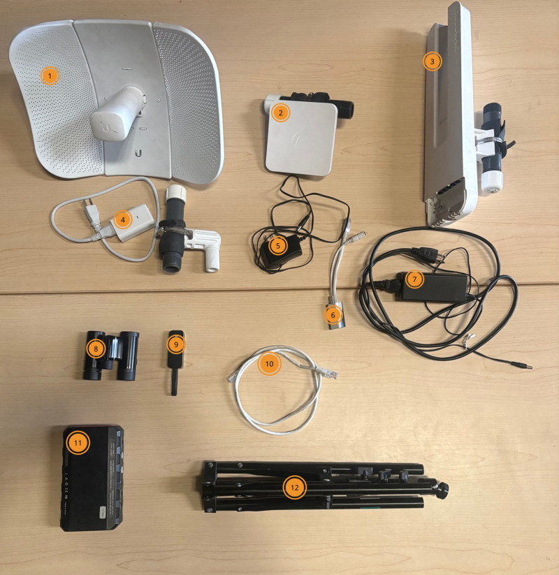
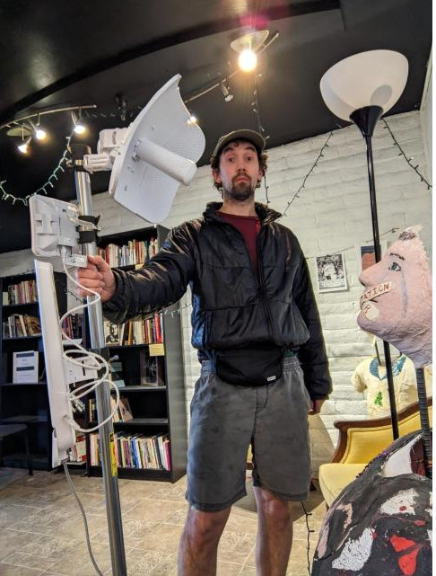

# Bag of Mesh

!!! info "How can this documentation be improved?"

    - Add photos of the bag, its contents and how it looks packed. 

The "bag of mesh" is a kit that includes the routers we commonly install on roofs and other equipment for performing site surveys. It is a successor to the "staff of mesh", which included all routers on a single pole.

## Checklist

- [ ] [LiteBeam](./litebeam.md) router (1)
- [ ] [OmniTIK](./omnitik.md) router (3)
- [ ] [SXTsq](./sxtsq.md) router (2)
- [ ] AC adapter for OmniTIK (7)
- [ ] AC adapter for SXTsq (5)
- [ ] POE injector for OmniTIK/SXTsaq (6)
- [ ] POE injector for LiteBeam (4)
- [ ] Ethernet cable (10)
- [ ] Power bank (11)
- [ ] Binoculars (8)
- [ ] Tripod (12)
- [ ] USB to Ethernet adapter (9)

## RIP Staff of Mesh

