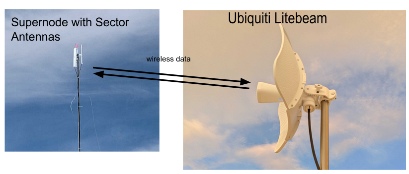
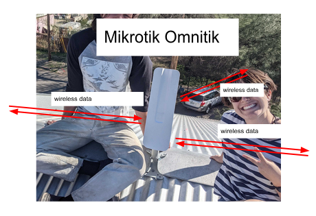
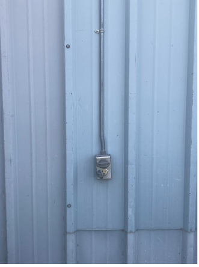
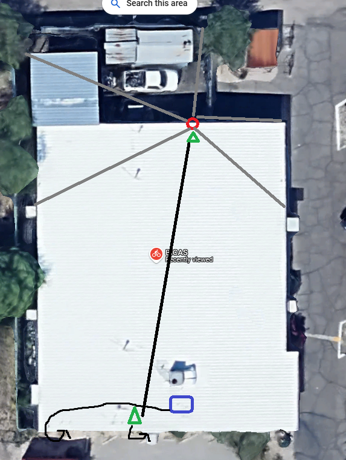
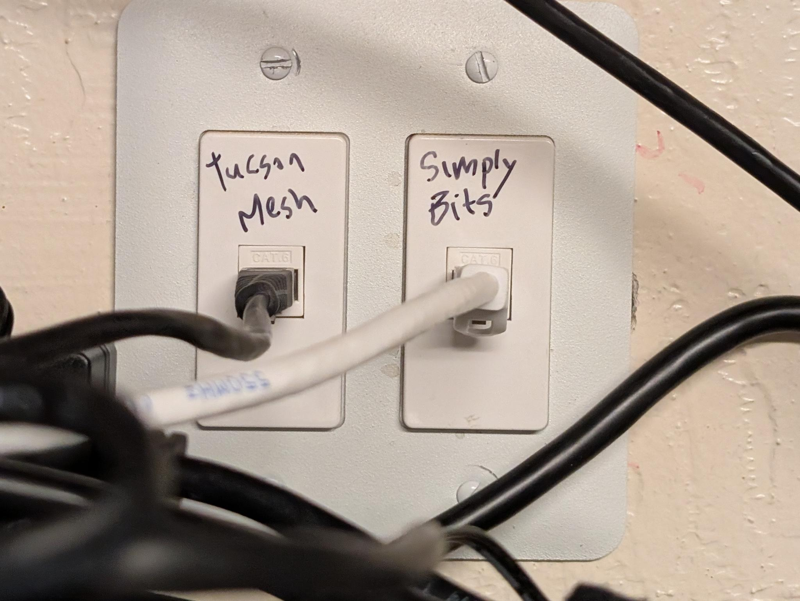
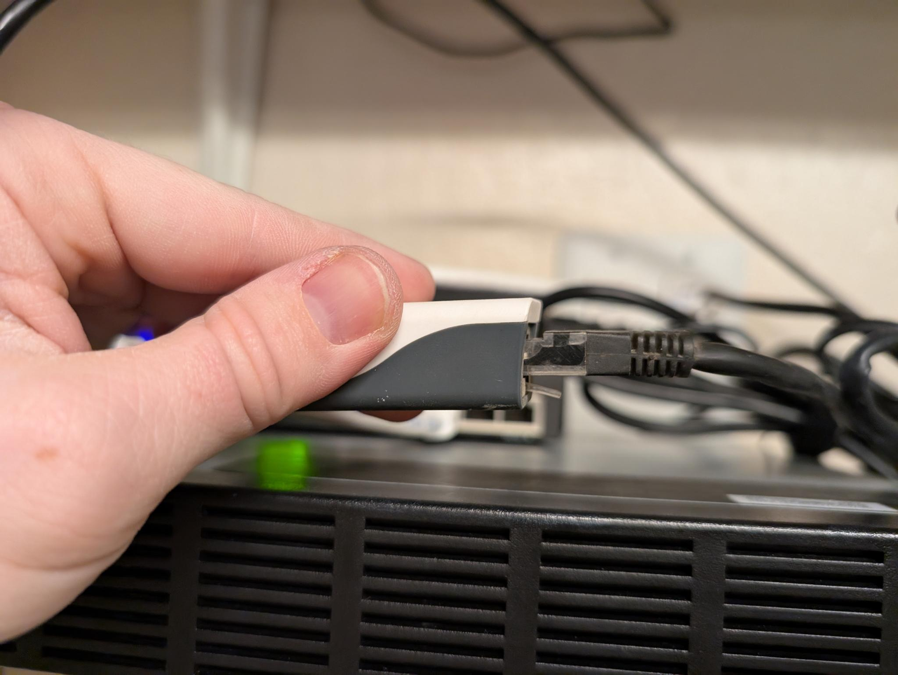
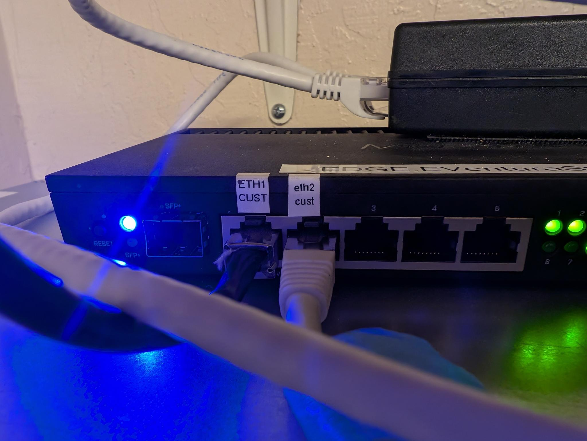
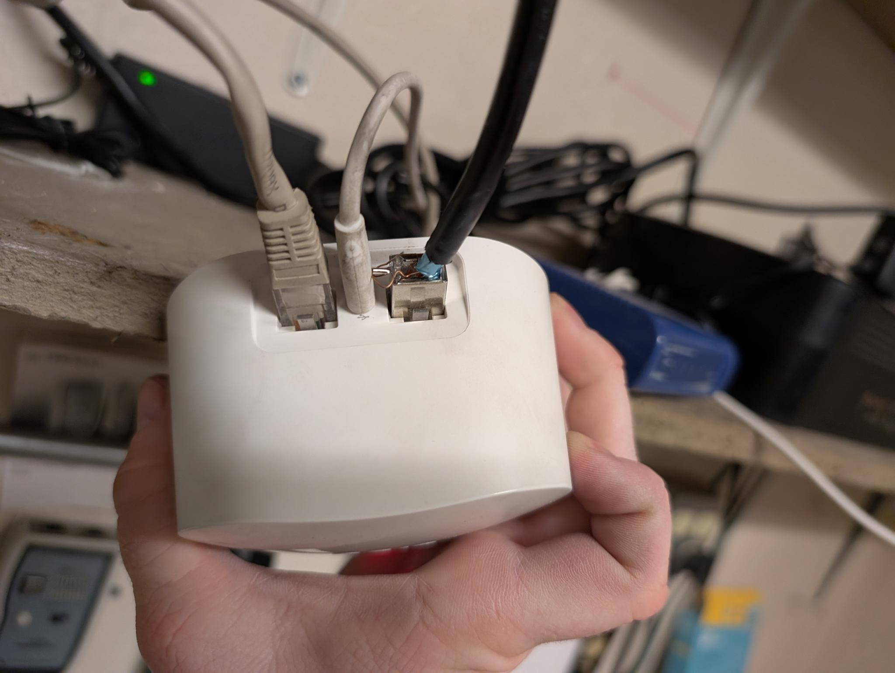
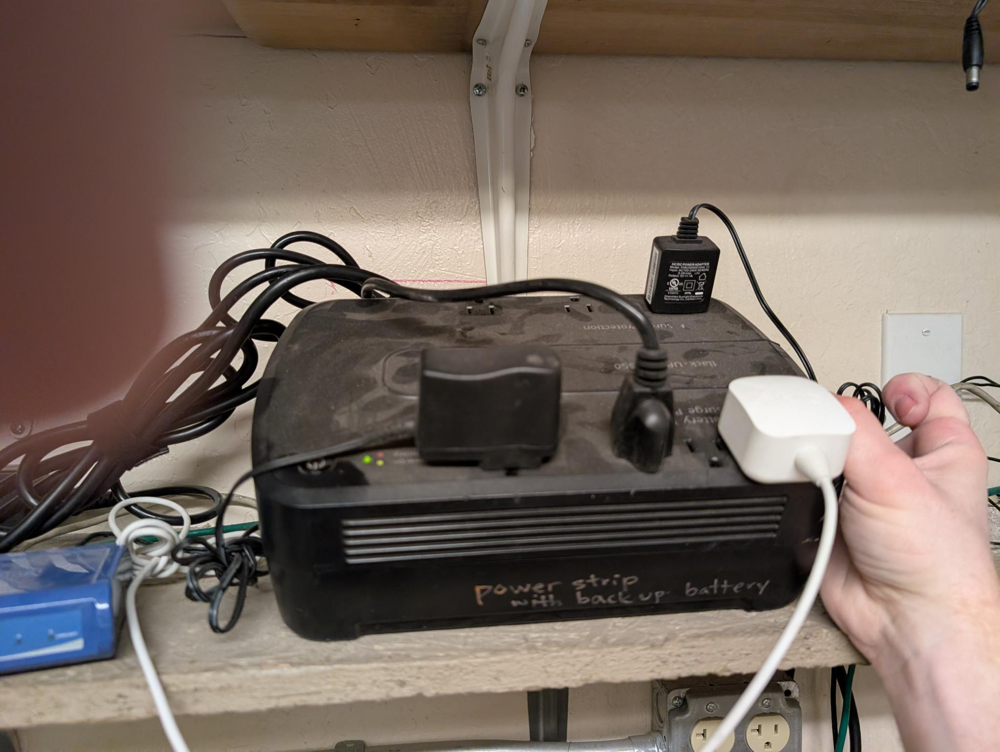

# BICAS 

This supernode is located at [BICAS](https://bicas.org/), a community bicycle project located at [2001 N 7th Ave](https://maps.app.goo.gl/uK3XnBHGnFK33Zqw9).

It was created in March 2025 when we moved the equipment that was at the former location of the BCC across the street.

## Hardware

- 3 [Ubiquity LiteAP](../../hardware/liteap.md) sector antennas.
- Omni 50: A [MikroTik OmniTIK 5 PoE ac](../../hardware/omnitik.md) that handles NAT and handoff with login.
- Omni 51: A [MikroTik OmniTIK 5 PoE ac](../../hardware/omnitik.md) that is attached to the same mast as the secto antennas. This device powers all three sector antennas. It is connected to Omni 50 by a single ethernet cable.
- TP Link ???: Wireless router formerly at BCC, now used to provide WiFi to BICAS. The WAN Port of this device is plugged into "ether2 cust" on the Mikrotik switch that belongs to Login.
- Point-to-point antenna that provides the uplink to Login Business, an internet exchange point.
- [fw-mesh-host](../servers/fw-mesh-host.md) server.

 Each sector antenna covers a 120 degree “sector” of the neighborhood so that together, they broadcast Tucson Mesh’s network in all directions outwards from BICAS. This allows other people to join the network by pointing their [LiteBeams](../../hardware/litebeam.md) towards the supernode.

The sector antennas, as well as Omni 51 are attached to a collapsible mast which is mounted with a custom bracket to the north side of the building. Four guy lines help stabalize the mast.

The two OmniTIKrouters on the roof help us do some of the networking required to keep the Mesh functioning and can connect to other OmniTIKS nearby.

The OnmiTIK is a router with an integrated omnidirectional antenna, meaning that it broadcasts a signal in a 360 degree radius around it. The OmniTIK creates an open 5Ghz WiFi network that is broadcast in all directions and named `Tucson Mesh Free Wifi`. This network allows people passing by to use the Mesh for free, and advertises Tucson Mesh.

Tucson Mesh purchases bandwidth in bulk from [Login Business](https://www.loginbusiness.com/), an internet exchange point in the Sugar Hill neighborhood two blocks south-east of BICAS. Login uses a point to point antenna to get bandwidth to the roof of BICAS which is then shared through the supernode with people in the neighborhood.

## Power for rooftop hardware

The OmniTIK routers are powered through an ethernet cable from a power over ethernet (PoE) injector that is plugged into a standard 3-prong wall outlet. The OmniTiks then passes on power to the sector antennas via outdoor rated ethernet cables.

Power is currently coming from an outdoor plug on the north side of the building, just inside the fence that circles the outdoor lot. ⚠️  **It is critical that this remains plugged in and powered at all times.** 

## Location of rooftop equipment

In this image, you can see the location of the mast and sector antennas (red circle), the guy lines (grey lines), the OmniTIK routers (green triangles), and the location of Login’s point-to-point antenna that provides bandwidth to the Mesh. Black arrows indicate where ethernet cables enter the building.

## Inside hardware connections

Both Tucson Mesh and Login have some equipment in the “networking cabinet” inside the BICAS office.

Login has a PoE injector that leads out to the roof through the "Simply Bits"  plug. Tucson Mesh has a PoE injector that goes out to the roof through the plug labeled "Tucson Mesh".

The black "Tucson Mesh" cable leads to our MikroTik PoE injector.

The other end of Mesh's MikroTik PoE injector goes into the port labeled "eth2 cust" on Login's switch, labeled “EDGE VENTURA”. Meanwhile, a patch cable goes from the port labeled "ETH1 CUST" to BICAS's router.

This is the other end of the patch cable going from the Login switch to BICAS's router:

Tucson Mesh's equipment is connected to the battery backup side of this UPS. ⚠️   **It is critical that this remains plugged in at all times!** 

## TP Link internet configuration

- Internet Connection Type: Static IP
- IP Address: 204.17.35.195
- Subnet Mask: 255.255.255.248
- Default Gateway: 204.17.35.193
- Primary DNS: 1.1.1.1
- Secondary DNS: 8.8.8.8

